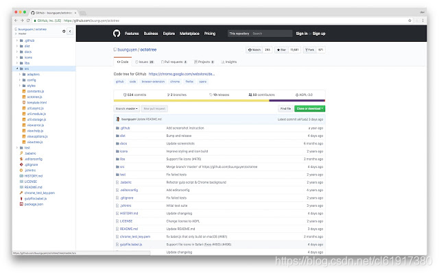
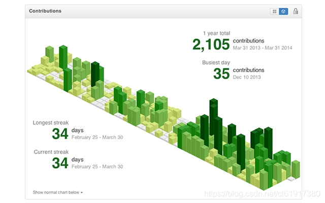
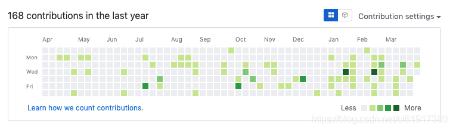
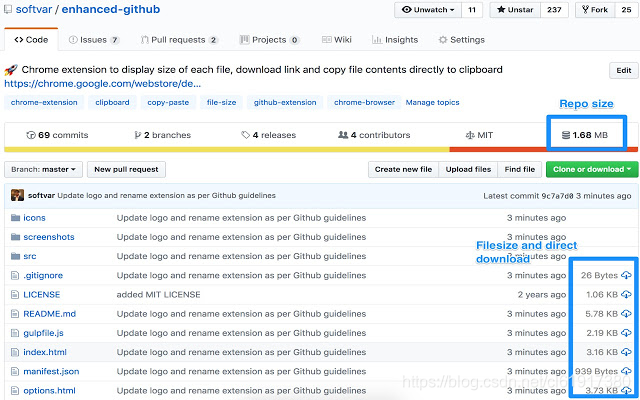
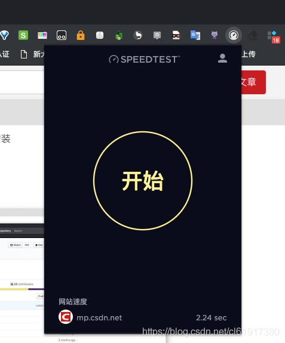
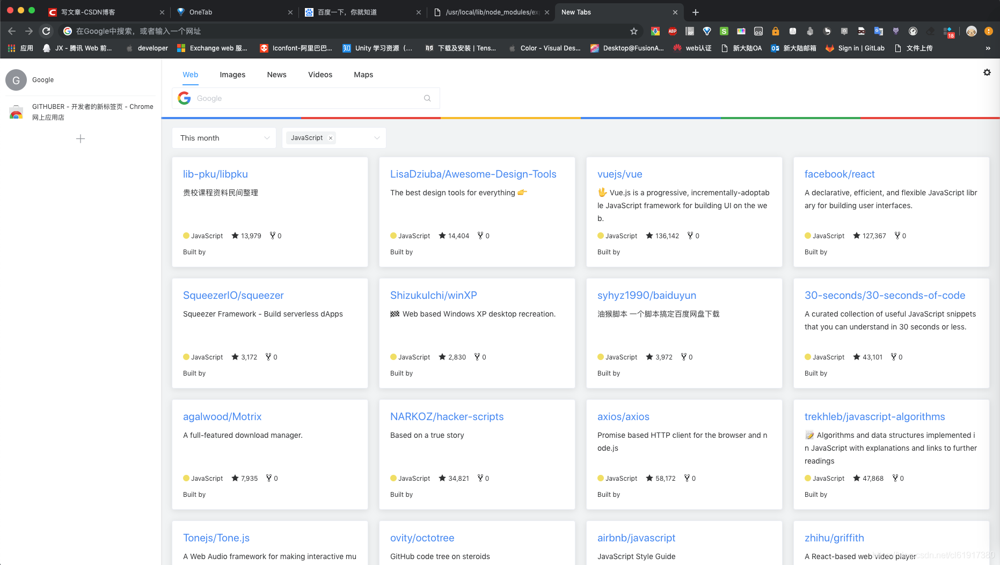

# github相关 chrome插件

`转载` `2019-04-03 16:41:46`

以下为chrome插件，需访问chrome商店才可以安装

### 1.Octotree

在github网站左侧显示源码的目录 

### 2.Isometric Contributions

柱形图方式显示贡献 

 

### 3.Enhanced Github

可以单独下载源码 

### 4.GitHub Hovercard

悬浮显示项目相关信息 

### 5.speedtest

测试网页速度 

### 6. GITHUBER-开发者的新标签页 打开新标签页时，显示排行前25的github项目 

