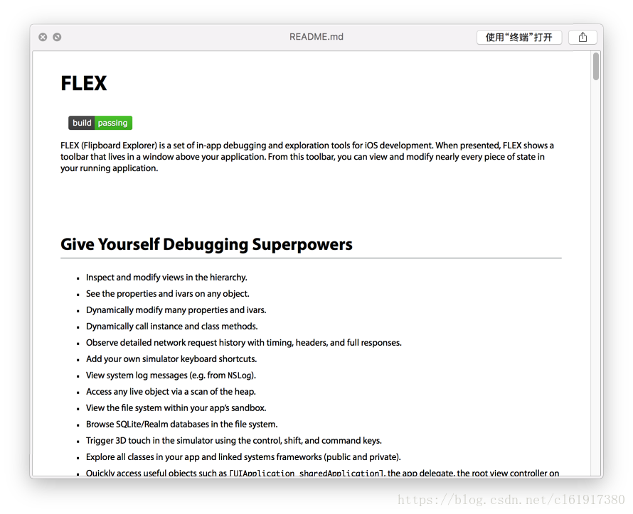
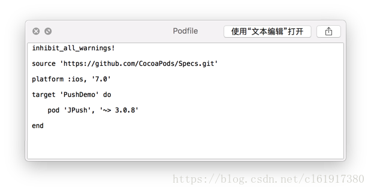
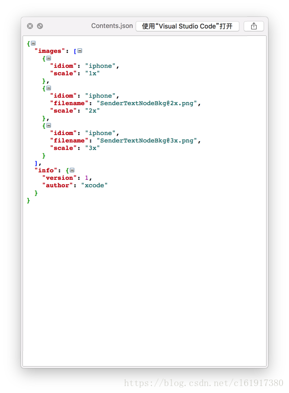
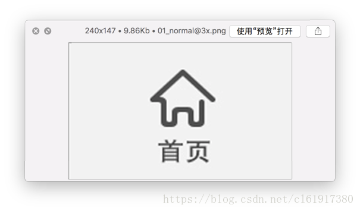
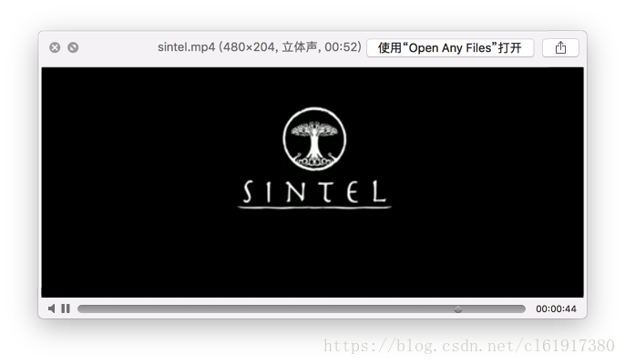

# mac下快速查看文件信息(Quick Look Plugs)

`转载` `2018-08-20 10:42:57`

转载自：[https://juejin.im/entry/59f60b1ef265da433562077b](https://juejin.im/entry/59f60b1ef265da433562077b)

首先安装brew

```bash
/usr/bin/ruby -e "$(curl -fsSL https://raw.githubusercontent.com/Homebrew/install/master/install)"
```


#直接安装所有：

```bash
brew cask install qlstephen qlcolorcode quicklook-json qlcolorcode qlmarkdown qlvideo qlimagesize
```


##QuicklookStephen 可以让您查看没有文件扩展名的纯文本文件。 可预览这样的文件 README、INSTALL、Capfile、CHANGELOG、etc…

```bash
$ brew cask install qlstephen
```





##QLColorCode 在预览源代码文件，高亮代码。

```bash
$ brew cask install qlcolorcode
```


##QuickLookJSON 格式化预览JSON文件。

```bash
$ brew cask install quicklook-json
```


##QLColorCode 在预览源代码文件，高亮代码。

```bash
$ brew cask install qlcolorcode
```





##QLMarkdown Markdown文件转换成静态页面预览。

```bash
$ brew cask install qlmarkdown
```





PS: qlimagesize在我的imac下不可用 ##qlImageSize 显示图像大小和分辨率。

```bash
$ brew cask install qlimagesize
```





QLVideo 预览大多数类型的视频文件，以及它们的缩略图，封面和元数据。

```bash
$ brew cask install qlvideo
```





