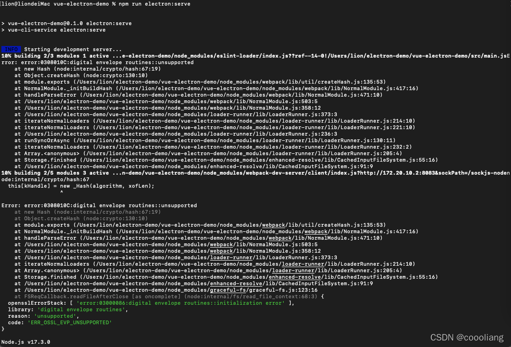

# Electron + Vue + ElementUI 之HelloWorld

`原创` `2021-12-28 09:54:55`

```bash
sudo npm install @vue/cli -g
sudo npm install @vue/cli-service -g
sudo npm install -g electron

node -v
vue -V
electron -v
```

```bash
vue create vue-electron-demo
```


```bash
cd vue-electron-demo 
npm run serve
```


添加Electron

```bash
sudo vue add electron-builder
```


运行electron

```bash
 npm run electron:serve
```


```bash
npm run electron:build
```

提示下载失败，貌似需要翻墙，vpn开全局多试一次可以了：
 ⨯ Get "https://github.com/electron/electron/releases/download/v13.6.3/electron-v13.6.3-darwin-x64.zip": read tcp 172.20.10.2:62709->140.82.114.4:443: read: operation timed out


添加ElementUI

```bash
vue add element
```

报node-sass错误,vue2使用的才是elementui，vue3用的是element-plus
```
sudo vue add element-plus
```


[Element Plus](https://element-plus.org/zh-CN)

运行Electron报错
[https://stackoverflow.com/questions/69692842/error-message-error0308010cdigital-envelope-routinesunsupported](https://stackoverflow.com/questions/69692842/error-message-error0308010cdigital-envelope-routinesunsupported)


node17运行存在以上问题，node需要使用16版本

```bash
n 16.13.0
npm run electron:serve
```


