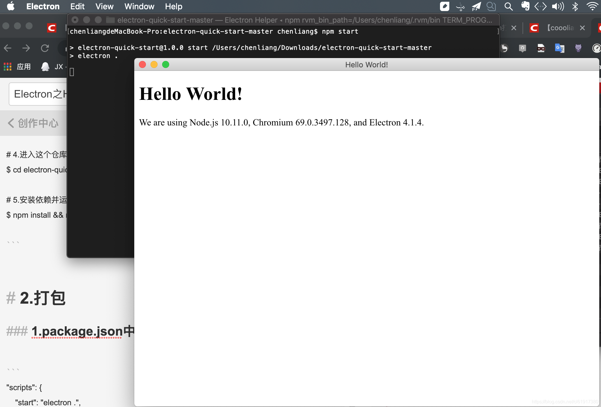
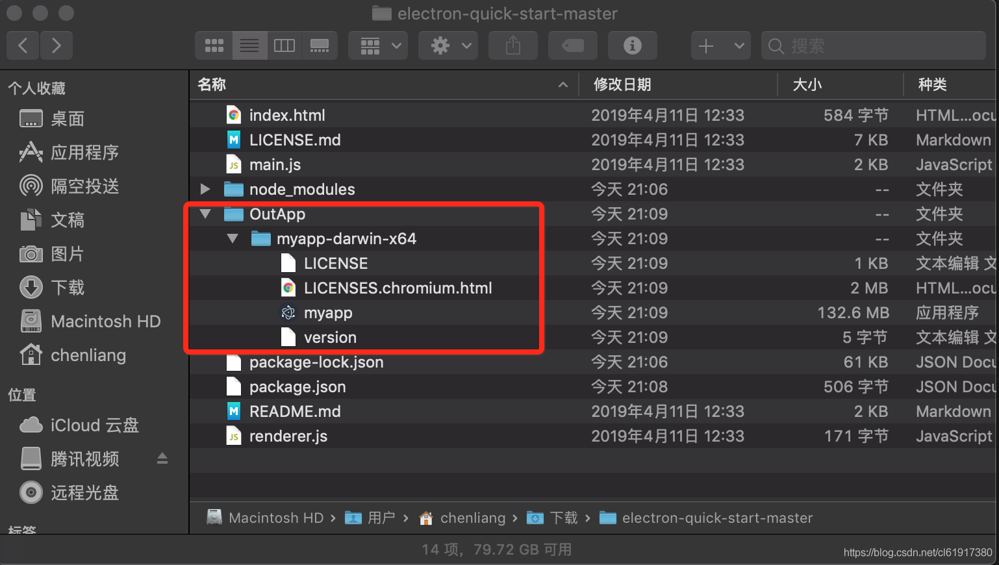

# Electron之HelloWorld

`原创` `2019-04-20 21:15:36`

##### 1. 安装Electron和demo

```bash
# 1.使用cnpm替换npm
$ npm install -g cnpm --registry=https://registry.npm.taobao.org

# 2.安装electron
$ cnpm i -D electron@latest

# 3.克隆示例项目的仓库
$ git clone https://github.com/electron/electron-quick-start

# 4.进入这个仓库
$ cd electron-quick-start

# 5.安装依赖并运行
$ npm install && npm start

```



##### 2. 打包

创建package.json

```bash
$ npm init
```

修改package.json内容:

```json
{
  "name": "electron-apidoc",
  "version": "1.0.0",
  "description": "",
  "main": "main.js",
  "scripts": {
    "start": "electron .",
    "package": "electron-packager . apidoc --platform=darwin --arch=x64 --out ./apidoc"
  },
  "author": "coooliang",
  "license": "ISC",
  "devDependencies": {
    "electron-packager": "^14.2.1"
  },
  "dependencies": {
    "electron": "^9.0.1"
  }
}
```

```bash
$ npm run-script package

Unable to determine Electron version. Please specify an Electron version
$ npm install electron
$ npm run-script package
```



##### Electron + Vue3:

```bash
vue create electron-vue3-demo
vue add electron-builder
npm run electron:serve
```
