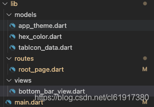
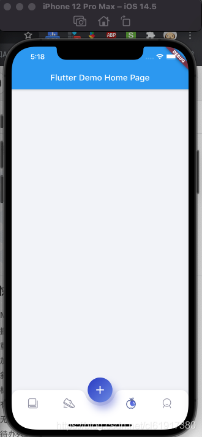

# Flutter之HelloWorld

`原创` `2021-06-28 17:19:38`

##### 1.下载Flutter

```bash
git clone -b dev https://github.com/flutter/flutter.git
export PATH="$PWD/flutter/bin:$PATH"
cd ./flutter
flutter doctor
```

##### 2. .bash_profile中添加path

```bash
export PATH=/Users/lion/flutter/bin:$PATH
export PUB_HOSTED_URL=https://pub.flutter-io.cn
export FLUTTER_STORAGE_BASE_URL=https://storage.flutter-io.cn
```
##### 3.下载xcode、android studio、VSCode

##### 4.新建项目flutter-demo

```bash
flutter create flutter-demo
cd flutter-demo
flutter run
```

----------

main.dart:

```dart
import 'package:flutter/material.dart';
import './routes/root_page.dart';

void main() {
  runApp(const MyApp());
}

class MyApp extends StatelessWidget {
  const MyApp({Key? key}) : super(key: key);

  // This widget is the root of your application.
  @override
  Widget build(BuildContext context) {
    return MaterialApp(
      title: 'Flutter Demo',
      theme: ThemeData(
        primarySwatch: Colors.blue,
      ),
      home: const MyHomePage(title: 'Flutter Demo Home Page'),
    );
  }
}

class MyHomePage extends StatefulWidget {
  const MyHomePage({Key? key, required this.title}) : super(key: key);

  final String title;

  @override
  State<MyHomePage> createState() => _MyHomePageState();
}

class _MyHomePageState extends State<MyHomePage> {

  @override
  Widget build(BuildContext context) {
    return Scaffold(
      appBar: AppBar(
        title: Text(widget.title),
      ),
      body: RootPage(),
    );
  }
}

```

root_page.dart:

```dart
import 'package:flutter/material.dart';
import '../models/tabIcon_data.dart';
import '../models/app_theme.dart';
import '../views/bottom_bar_view.dart';

class RootPage extends  StatefulWidget{
  @override
  _RootPageState createState() => _RootPageState();
}

class _RootPageState extends State<RootPage> with TickerProviderStateMixin {

  List<TabIconData> tabIconsList = TabIconData.tabIconsList;
  
  Widget tabBody = Container(
    color: AppTheme.background,
  );

  @override
  void initState() {
    tabIconsList.forEach((TabIconData tab) {
      tab.isSelected = false;
    });
    tabIconsList[0].isSelected = true;
    super.initState();
  }

  Future<bool> getData() async {
    await Future<dynamic>.delayed(const Duration(milliseconds: 200));
    return true;
  }

  Widget bottomBar() {
    return Column(
      children: <Widget>[
        const Expanded(
          child: SizedBox(),
        ),
        BottomBarView(
          tabIconsList: tabIconsList,
          addClick: () {
            debugPrint('add click');
          },
          changeIndex: (int index) {
            setState(() {
              debugPrint('click');
            });
          },
        ),
      ],
    );
  }

  @override
  Widget build(BuildContext context) {
    return Container(
      color: AppTheme.background,
      child: Scaffold(
        backgroundColor: Colors.transparent,
        body: FutureBuilder<bool>(
          future: getData(),
          builder: (BuildContext context, AsyncSnapshot<bool> snapshot) {
            if (!snapshot.hasData) {
              return const SizedBox();
            } else {
              return Stack(
                children: <Widget>[
                  tabBody,
                  bottomBar(),
                ],
              );
            }
          },
        ),
      ),
    );
  }
}
```

bottom_bar_view.dart:

```dart
import 'dart:math' as math;
import 'package:flutter/material.dart';
import '../models/tabIcon_data.dart';
import '../models/app_theme.dart';
import '../models/hex_color.dart';

class BottomBarView extends StatefulWidget {
  const BottomBarView(
      {Key? key, this.tabIconsList, this.changeIndex, this.addClick})
      : super(key: key);

  final Function(int index)? changeIndex;
  final Function()? addClick;
  final List<TabIconData>? tabIconsList;
  @override
  _BottomBarViewState createState() => _BottomBarViewState();
}

class _BottomBarViewState extends State<BottomBarView>
    with TickerProviderStateMixin {
  AnimationController? animationController;

  @override
  void initState() {
    animationController = AnimationController(
      vsync: this,
      duration: const Duration(milliseconds: 1000),
    );
    animationController?.forward();
    super.initState();
  }

  @override
  Widget build(BuildContext context) {
    Padding padding = Padding(
      padding: EdgeInsets.only(bottom: MediaQuery.of(context).padding.bottom),
      child: SizedBox(
        width: 38 * 2.0,
        height: 38 + 62.0,
        child: Container(
          alignment: Alignment.topCenter,
          color: Colors.transparent,
          child: SizedBox(
            width: 38 * 2.0,
            height: 38 * 2.0,
            child: Padding(
              padding: const EdgeInsets.all(8.0),
              child: ScaleTransition(
                alignment: Alignment.center,
                scale: Tween<double>(begin: 0.0, end: 1.0).animate(
                    CurvedAnimation(
                        parent: animationController!,
                        curve: Curves.fastOutSlowIn)),
                child: Container(
                  // alignment: Alignment.center,s
                  decoration: BoxDecoration(
                    color: AppTheme.nearlyDarkBlue,
                    gradient: LinearGradient(colors: [
                      AppTheme.nearlyDarkBlue,
                      HexColor('#6A88E5'),
                    ], begin: Alignment.topLeft, end: Alignment.bottomRight),
                    shape: BoxShape.circle,
                    boxShadow: <BoxShadow>[
                      BoxShadow(
                          color:
                              AppTheme.nearlyDarkBlue.withOpacity(0.4),
                          offset: const Offset(8.0, 16.0),
                          blurRadius: 16.0),
                    ],
                  ),
                  child: Material(
                    color: Colors.transparent,
                    child: InkWell(
                      splashColor: Colors.white.withOpacity(0.1),
                      highlightColor: Colors.transparent,
                      focusColor: Colors.transparent,
                      onTap: widget.addClick,
                      child: Icon(
                        Icons.add,
                        color: AppTheme.white,
                        size: 32,
                      ),
                    ),
                  ),
                ),
              ),
            ),
          ),
        ),
      ),
    );
    SizedBox sizedBox = SizedBox(
      width: Tween<double>(begin: 0.0, end: 1.0)
              .animate(CurvedAnimation(
                  parent: animationController!, curve: Curves.fastOutSlowIn))
              .value *
          64.0,
    );

    return Stack(
      alignment: AlignmentDirectional.bottomCenter,
      children: <Widget>[
        AnimatedBuilder(
          animation: animationController!,
          builder: (BuildContext context, Widget? child) {
            return Transform(
              transform: Matrix4.translationValues(0.0, 0.0, 0.0),
              child: PhysicalShape(
                color: AppTheme.white,
                elevation: 16.0,
                clipper: TabClipper(
                    radius: Tween<double>(begin: 0.0, end: 1.0)
                            .animate(CurvedAnimation(
                                parent: animationController!,
                                curve: Curves.fastOutSlowIn))
                            .value *
                        38.0),
                child: Column(
                  children: <Widget>[
                    SizedBox(
                      height: 62,
                      child: Padding(
                        padding:
                            const EdgeInsets.only(left: 8, right: 8, top: 4),
                        child: Row(
                          children: <Widget>[
                            Expanded(
                              child: TabIcons(
                                  tabIconData: widget.tabIconsList?[0],
                                  removeAllSelect: () {
                                    setRemoveAllSelection(
                                        widget.tabIconsList?[0]);
                                    widget.changeIndex!(0);
                                  }),
                            ),
                            Expanded(
                              child: TabIcons(
                                  tabIconData: widget.tabIconsList?[1],
                                  removeAllSelect: () {
                                    setRemoveAllSelection(
                                        widget.tabIconsList?[1]);
                                    widget.changeIndex!(1);
                                  }),
                            ),
                            sizedBox,
                            Expanded(
                              child: TabIcons(
                                  tabIconData: widget.tabIconsList?[2],
                                  removeAllSelect: () {
                                    setRemoveAllSelection(
                                        widget.tabIconsList?[2]);
                                    widget.changeIndex!(2);
                                  }),
                            ),
                            Expanded(
                              child: TabIcons(
                                  tabIconData: widget.tabIconsList?[3],
                                  removeAllSelect: () {
                                    setRemoveAllSelection(
                                        widget.tabIconsList?[3]);
                                    widget.changeIndex!(3);
                                  }),
                            ),
                          ],
                        ),
                      ),
                    ),
                    SizedBox(
                      height: MediaQuery.of(context).padding.bottom,
                    )
                  ],
                ),
              ),
            );
          },
        ),
        padding
      ],
    );
  }

  void setRemoveAllSelection(TabIconData? tabIconData) {
    if (!mounted) return;
    setState(() {
      widget.tabIconsList?.forEach((TabIconData tab) {
        tab.isSelected = false;
        if (tabIconData!.index == tab.index) {
          tab.isSelected = true;
        }
      });
    });
  }
}

class TabIcons extends StatefulWidget {
  const TabIcons({Key? key, this.tabIconData, this.removeAllSelect})
      : super(key: key);

  final TabIconData? tabIconData;
  final Function()? removeAllSelect;
  @override
  _TabIconsState createState() => _TabIconsState();
}

class _TabIconsState extends State<TabIcons> with TickerProviderStateMixin {
  @override
  void initState() {
    widget.tabIconData?.animationController = AnimationController(
      vsync: this,
      duration: const Duration(milliseconds: 400),
    )..addStatusListener((AnimationStatus status) {
        if (status == AnimationStatus.completed) {
          if (!mounted) return;
          widget.removeAllSelect!();
          widget.tabIconData?.animationController?.reverse();
        }
      });
    super.initState();
  }

  void setAnimation() {
    widget.tabIconData?.animationController?.forward();
  }

  @override
  Widget build(BuildContext context) {
    return AspectRatio(
      aspectRatio: 1,
      child: Center(
        child: InkWell(
          splashColor: Colors.transparent,
          focusColor: Colors.transparent,
          highlightColor: Colors.transparent,
          hoverColor: Colors.transparent,
          onTap: () {
            if (!widget.tabIconData!.isSelected) {
              
            }
            setAnimation();//TODO:总是响应
          },
          child: IgnorePointer(
            child: Stack(
              alignment: AlignmentDirectional.center,
              children: <Widget>[
                ScaleTransition(
                  alignment: Alignment.center,
                  scale: Tween<double>(begin: 0.88, end: 1.0).animate(
                      CurvedAnimation(
                          parent: widget.tabIconData!.animationController!,
                          curve:
                              Interval(0.1, 1.0, curve: Curves.fastOutSlowIn))),
                  child: Image.asset(widget.tabIconData!.isSelected
                      ? widget.tabIconData!.selectedImagePath
                      : widget.tabIconData!.imagePath),
                ),
                Positioned(
                  top: 4,
                  left: 6,
                  right: 0,
                  child: ScaleTransition(
                    alignment: Alignment.center,
                    scale: Tween<double>(begin: 0.0, end: 1.0).animate(
                        CurvedAnimation(
                            parent: widget.tabIconData!.animationController!,
                            curve: Interval(0.2, 1.0,
                                curve: Curves.fastOutSlowIn))),
                    child: Container(
                      width: 8,
                      height: 8,
                      decoration: BoxDecoration(
                        color: AppTheme.nearlyDarkBlue,
                        shape: BoxShape.circle,
                      ),
                    ),
                  ),
                ),
                Positioned(
                  top: 0,
                  left: 6,
                  bottom: 8,
                  child: ScaleTransition(
                    alignment: Alignment.center,
                    scale: Tween<double>(begin: 0.0, end: 1.0).animate(
                        CurvedAnimation(
                            parent: widget.tabIconData!.animationController!,
                            curve: Interval(0.5, 0.8,
                                curve: Curves.fastOutSlowIn))),
                    child: Container(
                      width: 4,
                      height: 4,
                      decoration: BoxDecoration(
                        color: AppTheme.nearlyDarkBlue,
                        shape: BoxShape.circle,
                      ),
                    ),
                  ),
                ),
                Positioned(
                  top: 6,
                  right: 8,
                  bottom: 0,
                  child: ScaleTransition(
                    alignment: Alignment.center,
                    scale: Tween<double>(begin: 0.0, end: 1.0).animate(
                        CurvedAnimation(
                            parent: widget.tabIconData!.animationController!,
                            curve: Interval(0.5, 0.6,
                                curve: Curves.fastOutSlowIn))),
                    child: Container(
                      width: 6,
                      height: 6,
                      decoration: BoxDecoration(
                        color: AppTheme.nearlyDarkBlue,
                        shape: BoxShape.circle,
                      ),
                    ),
                  ),
                ),
              ],
            ),
          ),
        ),
      ),
    );
  }
}

class TabClipper extends CustomClipper<Path> {
  TabClipper({this.radius = 38.0});

  final double radius;

  @override
  Path getClip(Size size) {
    final Path path = Path();

    final double v = radius * 2;
    path.lineTo(0, 0);
    path.arcTo(Rect.fromLTWH(0, 0, radius, radius), degreeToRadians(180),
        degreeToRadians(90), false);
    path.arcTo(
        Rect.fromLTWH(
            ((size.width / 2) - v / 2) - radius + v * 0.04, 0, radius, radius),
        degreeToRadians(270),
        degreeToRadians(70),
        false);

    path.arcTo(Rect.fromLTWH((size.width / 2) - v / 2, -v / 2, v, v),
        degreeToRadians(160), degreeToRadians(-140), false);

    path.arcTo(
        Rect.fromLTWH((size.width - ((size.width / 2) - v / 2)) - v * 0.04, 0,
            radius, radius),
        degreeToRadians(200),
        degreeToRadians(70),
        false);
    path.arcTo(Rect.fromLTWH(size.width - radius, 0, radius, radius),
        degreeToRadians(270), degreeToRadians(90), false);
    path.lineTo(size.width, 0);
    path.lineTo(size.width, size.height);
    path.lineTo(0, size.height);

    path.close();
    return path;
  }

  @override
  bool shouldReclip(TabClipper oldClipper) => true;

  double degreeToRadians(double degree) {
    final double redian = (math.pi / 180) * degree;
    return redian;
  }
}
```

app_theme.dart:

```dart
import 'package:flutter/material.dart';

class AppTheme {
  AppTheme._();
  static const Color nearlyWhite = Color(0xFFFAFAFA);
  static const Color white = Color(0xFFFFFFFF);
  static const Color background = Color(0xFFF2F3F8);
  static const Color nearlyDarkBlue = Color(0xFF2633C5);

  static const Color nearlyBlue = Color(0xFF00B6F0);
  static const Color nearlyBlack = Color(0xFF213333);
  static const Color grey = Color(0xFF3A5160);
  static const Color dark_grey = Color(0xFF313A44);

  static const Color darkText = Color(0xFF253840);
  static const Color darkerText = Color(0xFF17262A);
  static const Color lightText = Color(0xFF4A6572);
  static const Color deactivatedText = Color(0xFF767676);
  static const Color dismissibleBackground = Color(0xFF364A54);
  static const Color spacer = Color(0xFFF2F2F2);
  static const String fontName = 'Roboto';

  static const TextTheme textTheme = TextTheme(
    headline4: display1,
    headline5: headline,
    headline6: title,
    subtitle2: subtitle,
    bodyText2: body2,
    bodyText1: body1,
    caption: caption,
  );

  static const TextStyle display1 = TextStyle(
    fontFamily: fontName,
    fontWeight: FontWeight.bold,
    fontSize: 36,
    letterSpacing: 0.4,
    height: 0.9,
    color: darkerText,
  );

  static const TextStyle headline = TextStyle(
    fontFamily: fontName,
    fontWeight: FontWeight.bold,
    fontSize: 24,
    letterSpacing: 0.27,
    color: darkerText,
  );

  static const TextStyle title = TextStyle(
    fontFamily: fontName,
    fontWeight: FontWeight.bold,
    fontSize: 16,
    letterSpacing: 0.18,
    color: darkerText,
  );

  static const TextStyle subtitle = TextStyle(
    fontFamily: fontName,
    fontWeight: FontWeight.w400,
    fontSize: 14,
    letterSpacing: -0.04,
    color: darkText,
  );

  static const TextStyle body2 = TextStyle(
    fontFamily: fontName,
    fontWeight: FontWeight.w400,
    fontSize: 14,
    letterSpacing: 0.2,
    color: darkText,
  );

  static const TextStyle body1 = TextStyle(
    fontFamily: fontName,
    fontWeight: FontWeight.w400,
    fontSize: 16,
    letterSpacing: -0.05,
    color: darkText,
  );

  static const TextStyle caption = TextStyle(
    fontFamily: fontName,
    fontWeight: FontWeight.w400,
    fontSize: 12,
    letterSpacing: 0.2,
    color: lightText, // was lightText
  );
}
```

hex_color.dart:

```dart
import 'package:flutter/material.dart';

class HexColor extends Color {
  HexColor(final String hexColor) : super(_getColorFromHex(hexColor));

  static int _getColorFromHex(String hexColor) {
    hexColor = hexColor.toUpperCase().replaceAll('#', '');
    if (hexColor.length == 6) {
      hexColor = 'FF' + hexColor;
    }
    return int.parse(hexColor, radix: 16);
  }
}
```

tabIcon_data.dart:

```dart
import 'package:flutter/material.dart';

class TabIconData {
  TabIconData({
    this.imagePath = '',
    this.index = 0,
    this.selectedImagePath = '',
    this.isSelected = false,
    this.animationController,
  });

  String imagePath;
  String selectedImagePath;
  bool isSelected;
  int index;

  AnimationController? animationController;

  static List<TabIconData> tabIconsList = <TabIconData>[
    TabIconData(
      imagePath: 'assets/app/tab_1.png',
      selectedImagePath: 'assets/app/tab_1s.png',
      index: 0,
      isSelected: true,
      animationController: null,
    ),
    TabIconData(
      imagePath: 'assets/app/tab_2.png',
      selectedImagePath: 'assets/app/tab_2s.png',
      index: 1,
      isSelected: false,
      animationController: null,
    ),
    TabIconData(
      imagePath: 'assets/app/tab_3.png',
      selectedImagePath: 'assets/app/tab_3s.png',
      index: 2,
      isSelected: false,
      animationController: null,
    ),
    TabIconData(
      imagePath: 'assets/app/tab_4.png',
      selectedImagePath: 'assets/app/tab_4s.png',
      index: 3,
      isSelected: false,
      animationController: null,
    ),
  ];
}
```





