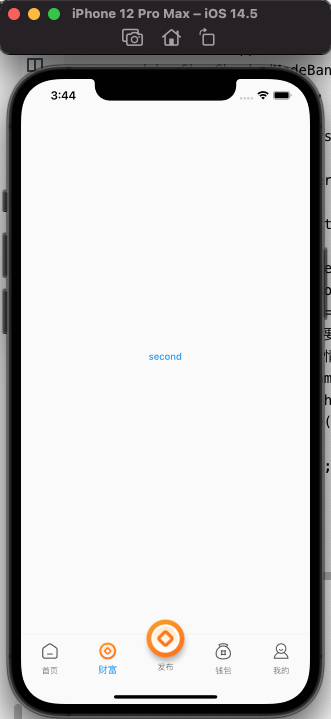

# 自定义TabBarController

`原创` `2021-07-21 15:45:58`

tabIcon_data.dart

```dart
// ignore_for_file: file_names

class TabIconData {
  TabIconData({
    this.imagePath = '',
    this.index = 0,
    this.selectedImagePath = '',
    this.centerImage = '',
    this.title = '',
    this.isSelected = false,
  });

  String imagePath;
  String selectedImagePath;
  String centerImage;
  String title;
  bool isSelected;
  int index;

  static List<TabIconData> tabIconsList = <TabIconData>[
    TabIconData(
      imagePath: 'assets/app/tab_1.png',
      selectedImagePath: 'assets/app/tab_1s.png',
      title: '首页',
      index: 0,
      isSelected: true,
    ),
    TabIconData(
      imagePath: 'assets/app/tab_2.png',
      selectedImagePath: 'assets/app/tab_2s.png',
      title: '财富',
      index: 1,
      isSelected: false,
    ),
    TabIconData(
      imagePath: '',
      selectedImagePath: '',
      centerImage: 'assets/app/tab_2s.png',
      title: '发布',
      index: 4,
      isSelected: false,
    ),
    TabIconData(
      imagePath: 'assets/app/tab_3.png',
      selectedImagePath: 'assets/app/tab_3s.png',
      title: '钱包',
      index: 2,
      isSelected: false,
    ),
    TabIconData(
      imagePath: 'assets/app/tab_4.png',
      selectedImagePath: 'assets/app/tab_4s.png',
      title: '我的',
      index: 3,
      isSelected: false,
    ),
  ];
}
```

tab_view_controller.dart

```dart
import 'package:flutter/material.dart';
import '../models/tabIcon_data.dart';

class TabViewController extends StatefulWidget {
  late List<TabIconData> tabIconsList;

  late List<Widget> pages;

  int initialPage = 0;

  bool isScrollPage = false;

  @override
  _TabViewControllerState createState() => _TabViewControllerState();
}

class _TabViewControllerState extends State<TabViewController> with TickerProviderStateMixin {
  late PageController pageController;
  late int page;
  int currentIndex = 0;

  @override
  void initState() {
    super.initState();
    page = currentIndex;
    pageController = PageController(initialPage: widget.initialPage);
  }

  @override
  Widget build(BuildContext context) {
    bool isScrollPage = widget.isScrollPage;
    double windowBottom = (MediaQuery.of(context).padding.bottom + 35.0);
    PageView pageView;
    if (isScrollPage) {
      pageView = PageView(
        children: widget.pages,
        controller: pageController,
        onPageChanged: onPageChanged,
      );
    } else {
      pageView = PageView(
        physics: const NeverScrollableScrollPhysics(),
        children: widget.pages,
        controller: pageController,
        onPageChanged: onPageChanged,
      );
    }
    Widget align = Container();
    if (widget.tabIconsList.length > 4) {
      TabIconData data = widget.tabIconsList[2];
      Widget centerImage = Container();
      if (data.centerImage != '') {
        centerImage = Image.asset(data.centerImage);
      }
      align = Align(
        child: Padding(
          padding: EdgeInsets.only(bottom: windowBottom),
          child: FloatingActionButton(
            backgroundColor: Colors.white,
            child: centerImage,
            onPressed: onCenterTap,
          ),
        ),
        alignment: Alignment.bottomCenter,
      );
    }
    return Scaffold(
        primary: true,
        appBar: PreferredSize(
            child: Container(
              height: 0, //标题置顶
              decoration: const BoxDecoration(),
              child: const SafeArea(child: Text("")),
            ),
            preferredSize: const Size(double.infinity, 60)),
        body: Stack(children: <Widget>[
          Scaffold(
            body: pageView,
            bottomNavigationBar: bottomNavigationBar(),
          ),
          align
        ]));
  }

  Widget bottomNavigationBar() {
    List<BottomNavigationBarItem> items = [];
    for (int i = 0; i < widget.tabIconsList.length; i++) {
      TabIconData data = widget.tabIconsList[i];
      if (currentIndex == i) {
        data.isSelected = true;
      } else {
        data.isSelected = false;
      }
      BottomNavigationBarItem item;
      if (data.imagePath == '' || data.selectedImagePath == '') {
        item = BottomNavigationBarItem(
          icon: const Icon(null),
          label: data.title,
          backgroundColor: Colors.white,
        );
      } else {
        item = BottomNavigationBarItem(
          icon: Padding(
              padding: const EdgeInsets.all(5),
              child: Image.asset(
                data.isSelected ? data.selectedImagePath : data.imagePath,
                width: 25,
                height: 25,
              )),
          label: data.title,
        );
      }
      items.add(item);
    }
    return Theme(
        data: ThemeData(
          splashColor: Colors.transparent,
          highlightColor: Colors.transparent,
        ),
        child: BottomNavigationBar(
            onTap: (index) {
              currentIndex = index;
              pageController.jumpToPage(index);
            },
            currentIndex: page,
            type: BottomNavigationBarType.fixed,
            items: items));
  }

  void onCenterTap() {
    currentIndex = 2;
    pageController.jumpToPage(2);
  }

  void onPageChanged(int page) {
    setState(() {
      currentIndex = page;
      this.page = page;
    });
  }
}
```


main.dart

```dart
import 'dart:io';

import 'package:demo1/models/tabIcon_data.dart';
import 'package:demo1/routes/first_screen/first_page.dart';
import 'package:demo1/routes/home/four_page.dart';
import 'package:demo1/routes/home/scan_page.dart';
import 'package:demo1/routes/home/second_page.dart';
import 'package:demo1/routes/home/third_page.dart';
import 'package:demo1/views/tab_view_controller.dart';
import 'package:flutter/material.dart';
import 'package:flutter/services.dart';

void main() {
  runApp(const MyApp());
  if (Platform.isAndroid) {
    //以下两行 设置android状态栏为透明的沉浸。写在组件渲染之后，是为了在渲染后进行set赋值，覆盖状态栏，写在渲染之前MaterialApp组件会覆盖掉这个值。
    SystemChrome.setSystemUIOverlayStyle(const SystemUiOverlayStyle(statusBarColor: Colors.transparent));
  }
}

class MyApp extends StatelessWidget {
  const MyApp({Key? key}) : super(key: key);

  // This widget is the root of your application.
  @override
  Widget build(BuildContext context) {
    TabViewController tabViewController = TabViewController();
    tabViewController.tabIconsList = TabIconData.tabIconsList;
    tabViewController.isScrollPage = false;
    tabViewController.pages = [FirstPage(), SecondPage(), ScanPage(), ThirdPage(), FourPage()];

    return MaterialApp(
        debugShowCheckedModeBanner: false,
        title: 'Flutter Demo',
        theme: ThemeData(
          primarySwatch: Colors.blue,
        ),
        home: tabViewController,
        routes: {
          "home_page": (context) => FirstPage(),
        },
        onGenerateRoute: (RouteSettings settings) {
          return MaterialPageRoute(builder: (context) {
            String? routeName = settings.name;
            // 如果访问的路由页需要登录，但当前未登录，则直接返回登录页路由，
            // 引导用户登录；其它情况则正常打开路由。
            debugPrint(routeName);
            if (routeName == 'home_page') {
              return FirstPage();
            }
            return FirstPage();
          });
        });
  }
}
```

运行结果：

