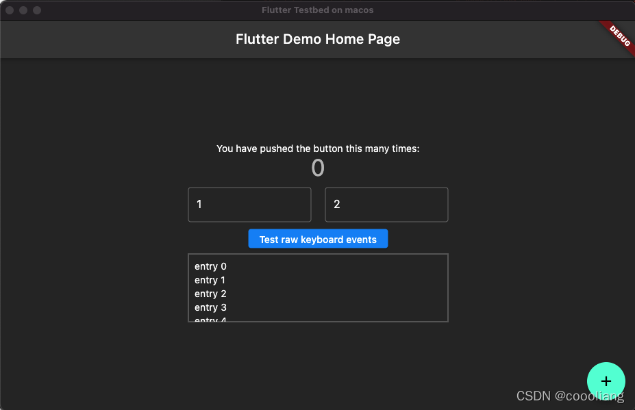

# Flutter桌面开发之HelloWorld

`原创` `2021-12-20 10:16:03`

```bash
flutter channel master
flutter upgrade --force
flutter doctor 
flutter config --enable-linux-desktop 
flutter config --enable-macos-desktop
flutter config --enable-windows-desktop
flutter devices
```

```bash
git clone https://github.com/google/flutter-desktop-embedding.git
cd flutter-desktop-embedding
cd testbed

flutter packages get
flutter precache --macos
flutter run
```


