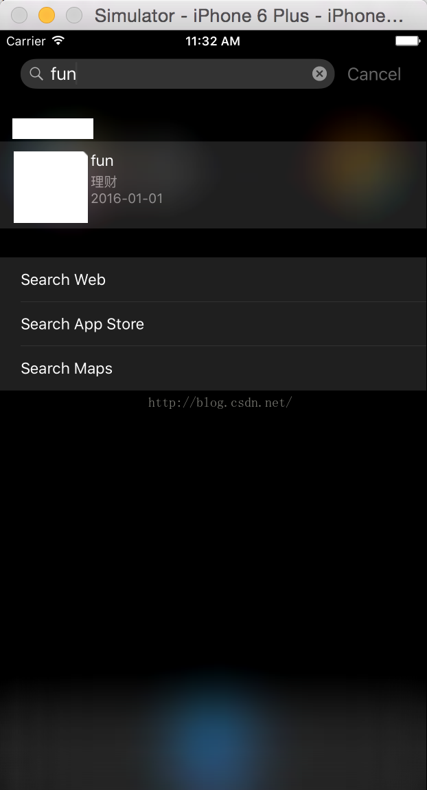
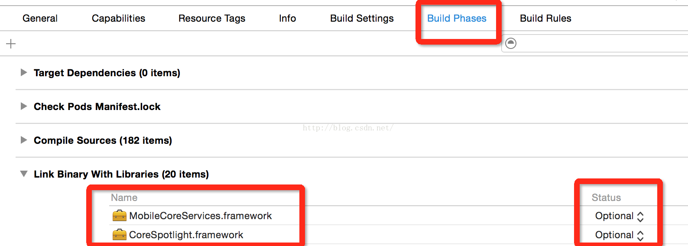

# iOS9的CoreSpotlight(OC语言)

`原创` `2015-08-12 11:38:21`

什么是CoreSpotlight？就是在IOS9下，让用户在下拉的搜索页面里可以搜索到你的应用。

```objectivec
#import <Foundation/Foundation.h>

@interface IOS9SearchAPIUtil : NSObject

+(IOS9SearchAPIUtil *)sharedInstance;


-(void)addSearchItemsArray:(NSArray *)array;


@end
```

```objectivec
#import "IOS9SearchAPIUtil.h"
#import <CoreSpotlight/CoreSpotlight.h>
#import <MobileCoreServices/MobileCoreServices.h>
#import "NSString+Wrapper.h"
#import <UIKit/UIKit.h>

#define IOS9SearchAPIUtil_domainIdentifier @"com.searchapi.shows"
@implementation IOS9SearchAPIUtil

+(IOS9SearchAPIUtil *)sharedInstance{
    static IOS9SearchAPIUtil *instance = nil;
    static dispatch_once_t predicate;
    dispatch_once(&predicate, ^{
        instance = [[self alloc] init];
    });
    return instance;
}

-(void)addSearchItemsArray:(NSArray *)array{
    if(IS_IOS_9){
        NSMutableArray <CSSearchableItem *> *searchableItems = [NSMutableArray arrayWithCapacity:0];
        for (NSDictionary *d in array) {
            NSString *title = [d objectForKey:@"title"];
            NSString *desc = [d objectForKey:@"desc"];
            NSString *time = [d objectForKey:@"time"];
            NSString *nid = [d objectForKey:@"nid"];
            CSSearchableItemAttributeSet *attributeSet = [[CSSearchableItemAttributeSet alloc]initWithItemContentType:@"SearchAPIViews"];
            attributeSet.title = title;
            attributeSet.contentDescription = [NSString stringWithFormat:@"%@\n%@",desc,time];
            NSMutableArray *keywords = [NSMutableArray arrayWithArray:[title split:@" "]];
            [keywords addObject:desc];
            attributeSet.keywords = keywords;
            NSString *identifiner = [NSString stringWithFormat:@"%@",nid];
            [searchableItems addObject:[[CSSearchableItem alloc]initWithUniqueIdentifier:identifiner domainIdentifier:IOS9SearchAPIUtil_domainIdentifier attributeSet:attributeSet]];
        }
        
        [[CSSearchableIndex defaultSearchableIndex]indexSearchableItems:searchableItems completionHandler:^(NSError * __nullable error) {
            if(error != nil){
                NSLog(@"%@",error.localizedDescription);
            }else {
                NSLog(@"Items were indexed successfully");
            }
        }];
    }
}

@end
```

使用方法： 

```objectivec
[[IOS9SearchAPIUtil sharedInstance]addSearchItemsArray:@[@{@"nid":@"fin://1238796",@"title":@"fin",@"desc":@"基金",@"time":@"2014-01-01"},@{@"nid":@"fun://54fdsaf32",@"title":@"fun",@"desc":@"理财",@"time":@"2016-01-01"}]];
```
效果： 



PS:

上传framework:


 
Swift版本：http://www.csdn.net/article/2015-07-16/2825222-search-apis 

```objectivec
#define IS_IOS_9 ([[[UIDevice currentDevice] systemVersion] floatValue] >=9.0 ? YES : NO)
```

split就是调用NSString的 componentsSeparatedByString 方法;

NSString+Wapper.h 类参照：http://blog.csdn.net/coooliang/article/details/45871149 
