# 【IOS开发】如何在一台mac上进行ios开发

`原创` `2015-04-30 17:03:36`

1.CertificateSigningRequest.certSigningRequest文件，一直以为这个文件和IOS开发有关系，原来不是的，你只要有苹果用户就算不是开发者也可以得到这个文件。（就因为这一点，所以我一开始一直很乱不知道怎么回事。）

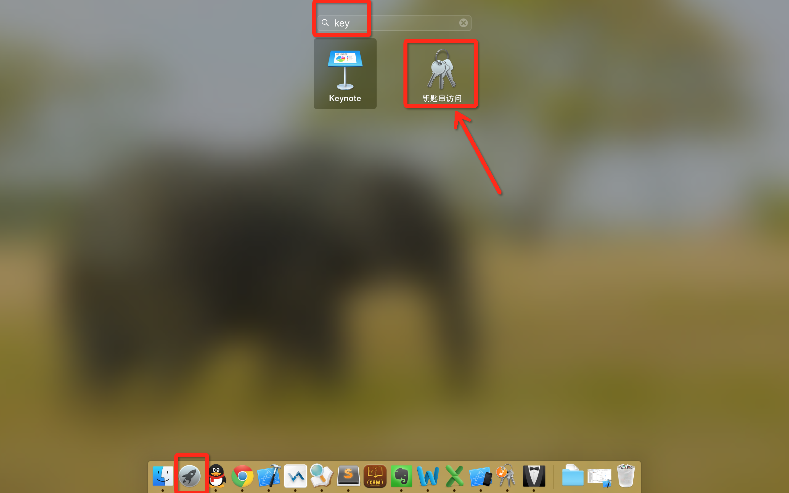
  
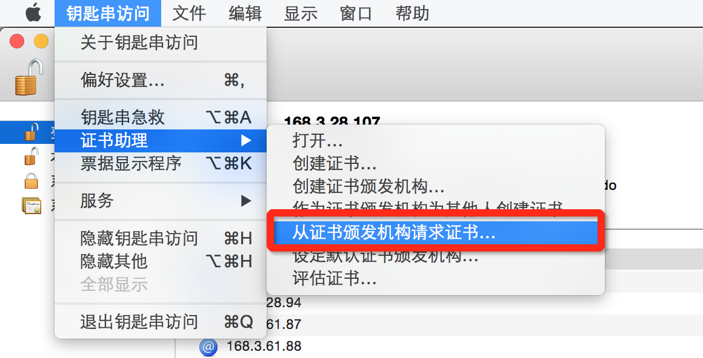
  
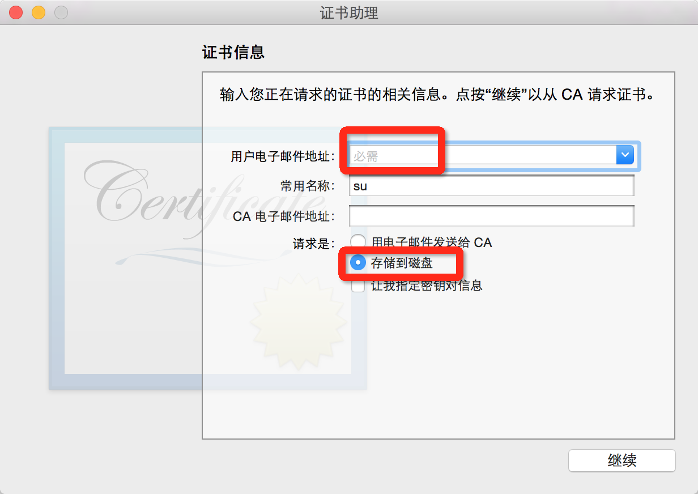
  
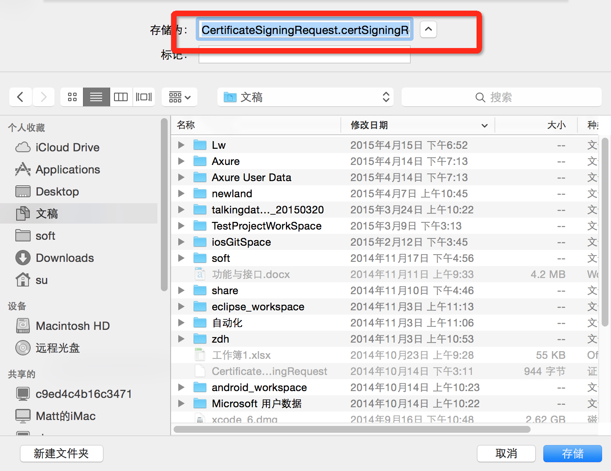

2.进入开发者平台  
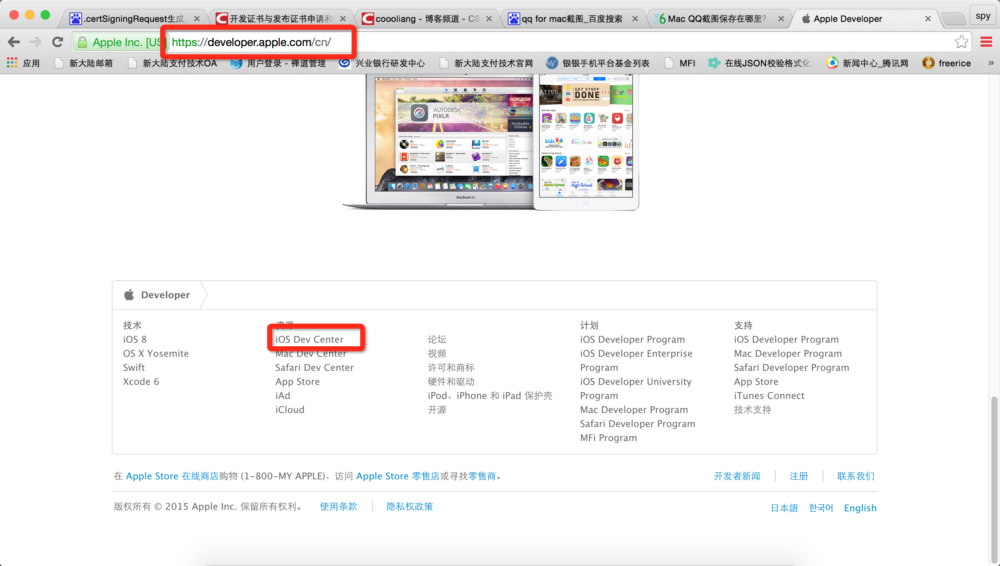
  
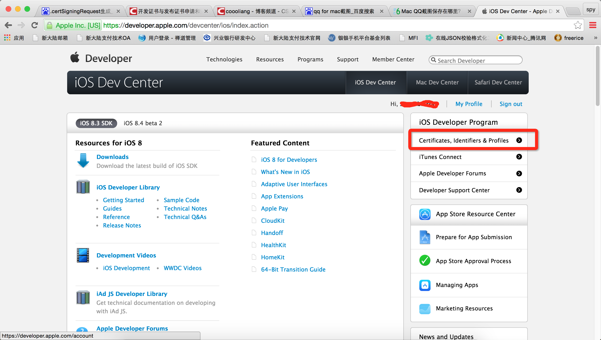
  
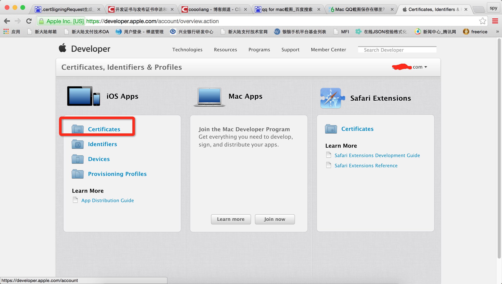

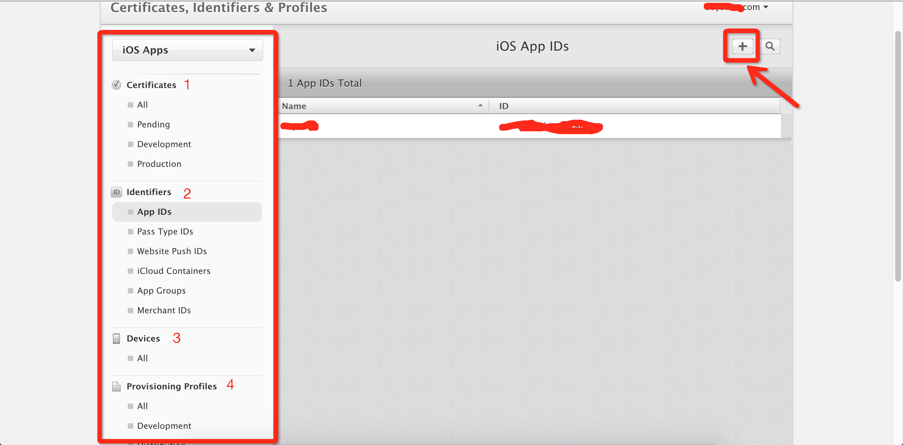

3.从上到下1,2,3,4下来就OK  1）cer需要刚刚得到的CertificateSigningRequest.certSigningRequest文件；  2）配置iOS App IDs，就是ios应用中的Targets–general–Identity–Bundle Identifier的内容，(可配置com.xxx.*)；  3)Devices，表示当前开发机可以在哪些真机上安装这个正在开发的应用，如果有新的机器加进来，需要在这里配置一下，然后下载第四步的profiles文件双击一下就可以了；  4)profiles文件配置，这里要的正好就是上面3步配置的cer,appids,devices内容。  
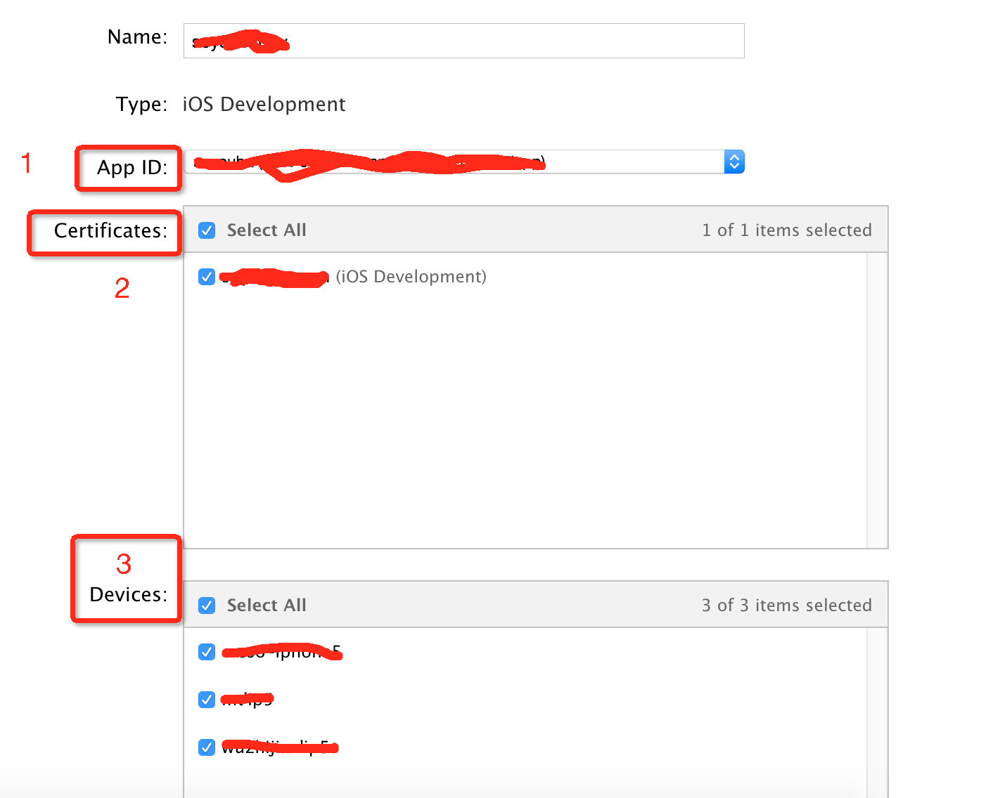
  5）把第一步的cer，和第四步profiles文件下载下来，双击一下就OK了，这时候本机就可以进行开发了。

4.新加入开发组的成员想要进行ios开发，只需要两个文件：**.p12**（从钥匙串导出）和**描述文件**（第四步的profiles文件）  
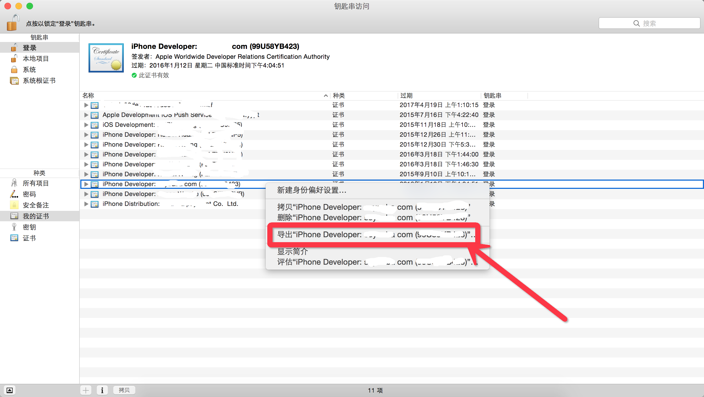
  
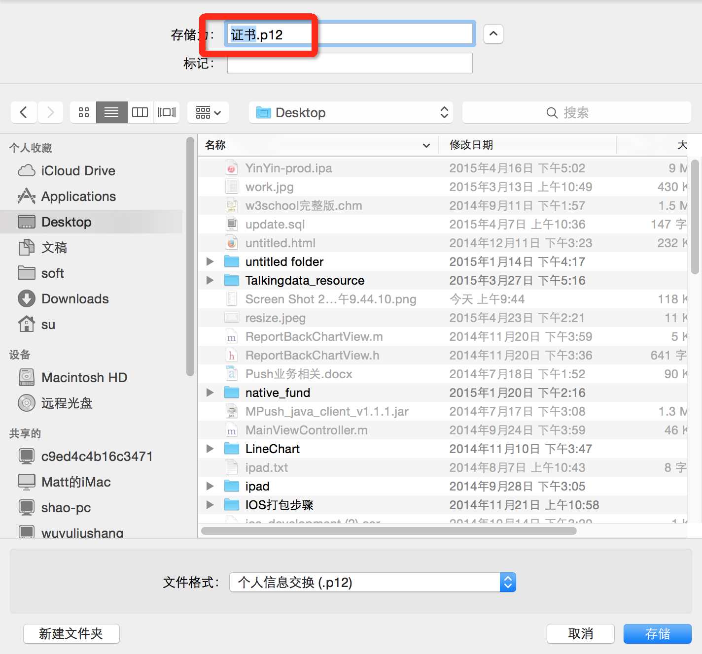

