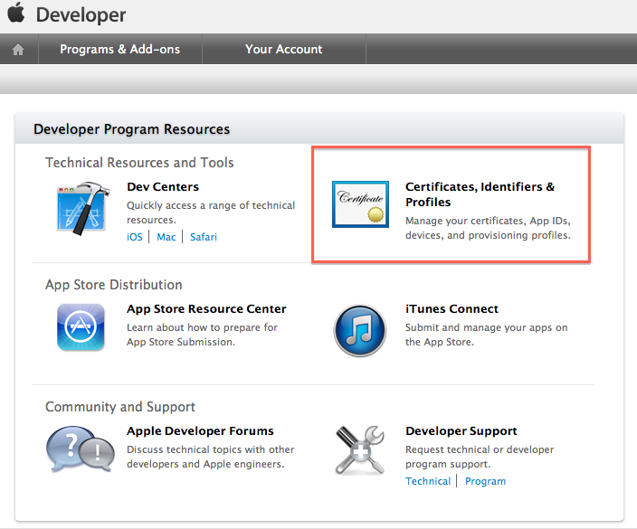
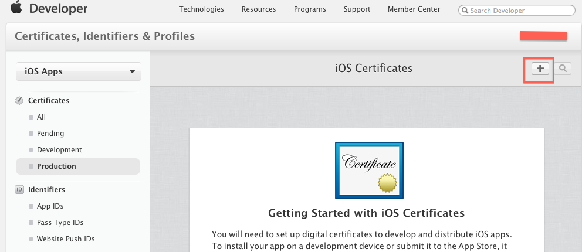

# IOS申请证书，Certificates, Identifiers &Profiles 简介

`转载` `2014-05-22 15:34:23`

文章转载自：http://my.oschina.net/u/1245365/blog/196263

Certificates, Identifiers &Profiles 简介 下面来介绍如何申请证书： 第一步：申请本地证书 第二步： 在开发者账号里申请证书    

Certificates, Identifiers &Profiles 简介

 Certificates

+   Certificates即 "证书"，约等于通行证，申请证书是我们进行真机调试与发布的第一步。证书有两种：  1、 开发证书 （DevelopmentCertificates ），主要是授权mac设备的开发权限  2、 发布证书 （DistributionCertificates）， 主要是授权mac设置发布权限 

 Identifiers
+   Identifiers 即"标识符"，约等于是身份证，用于创建以下三个：  App IDs  Pass Type IDs  Website Push IDs 

 其中，App ID是应用的唯一标示符，每一个应用的app id是不一样的 

 Devices
+   Devices 用于创建测试设备，一个99美元允许创建100个设备 

 Provisioning Profiles

+   **Provisioning Profiles 即"描述文件"。它的功能很特别，专门用于将Certificates、Identifiers、Devices结合起来，形成一个描述证书、标示符的描述文件。Provisioning Profiles放入我们的xcode中，让 xcode知道我们的证书和哪些设备之类的信息相匹配。**  **** 

 ** **

#  下面来介绍如何申请证书：

##  第一步：申请本地证书

 申请证书必须在我们的电脑上先申请一个证书，找到 ：

               

 点击"其他"，找到"钥匙串"：

              

 选择从颁发机构申请证书，注意下面的红色框，必须选择那一个才可以：

              

 点击后看到：

                    

 如果选择 "存储到磁盘",那么"用户邮件地址" 随便填一个就好，点击"继续"：

                    

 "存储为："可以给证书命名，选择一个位置，点击"存储"：

                    

 这样在桌面就生成了一个证书。

 注意这一个本地证书可以同时用来生成"开发证书"和"发布证书"。

  

 下面只介绍"发布证书"的申请，申请"开发证书"步骤相同，就是换一个选项

##  第二步： 在开发者账号里申请证书       

 **我们进入99美元开发账号看到：**

 **            

**

 **点击**Certificates, Identifiers & Profiles，进入页面看到：

                        

 如果要申请开发证书就选择Development,如果要申请发布证书，就选择Production,步骤都是选择"+"号后添加证书：

                           

 点击"+"后看到：

                           

 如果是选择 "开发证书"，点击第一个红框

                  

 如果是选择 "发布证书"，点击第二个红框

                       

 选择好后，点击"continue"：

                             

 

 点击后出现：                         

 选择"Choose File" 将刚刚申请的保存在本地的证书上传：

                             

                             

 上传好后，点击"Generate" 就可以生成证书了。

  

 

 

 选择"Download"。

 这时，我们在本地生成的证书就没用了，可以删除。

  

 我们返回到证书的界面可以看到我们申请的证书：

 

 

 一般申请一个 发布证书（IOS Distribution），一个开发证书（IOS Development）就够用了。

  

 找到下载的文件，双击它，添加到钥匙串里就好了。在这一步里，如果钥匙串拒绝添加，直接将其拖进钥匙串就行：

 

 
这样证书就申请完毕了，有了证书后，接下来可以申请各种各样的描述文件供开发使用
