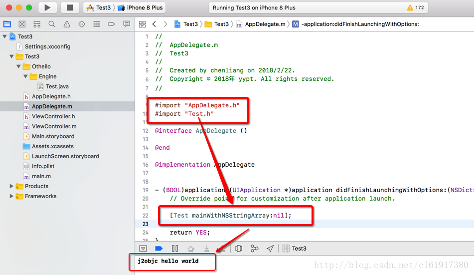

# Xcode中调用java文件之HelloWorld

`原创` `2018-02-22 11:16:00`

# 在Xcode中调用java文件

由于最近想开发一个exchange的IOS客户端的邮箱应用程序，但是只找到了ews-java-api所以想来想去还是需要xcode中安装j2objc来实现吧，目前只是实现了第一步，调用Java类成功； 具体步骤如下： 我使用的xcode版本为9.2，j2objc版本为2.0.5

1.下载j2objc的releases版本，不是源码版本 [https://github.com/google/j2objc/releases](https://github.com/google/j2objc/releases)

2.创建一个新的项目名叫Test3

3.添加Settings.xcconfig，并填写releases解压目录，内容如下：


```bash
J2OBJC_HOME = /Users/su/Downloads/j2objc-2.0.5;
HEADER_SEARCH_PATHS = "${J2OBJC_HOME}/frameworks/JRE.framework/Headers";
FRAMEWORK_SEARCH_PATHS = "${J2OBJC_HOME}/frameworks";
```


4.project -> build settings中添加配置 

```
J2OBJC_HOME -> /Users/su/Downloads/j2objc-2.0.5 Framework Search Paths->"${J2OBJC_HOME}/frameworks" 

Header Search Paths:

“${J2OBJC_HOME}/frameworks/JRE.framework/Headers” 
```


5.Build Rules -> Java source files 添加

```bash
if [ ! -f "${J2OBJC_HOME}/j2objc" ]; then echo "J2OBJC_HOME not correctly defined in Settings.xcconfig, currently set to '${J2OBJC_HOME}'"; exit 1; fi;
"${J2OBJC_HOME}/j2objc" -d ${DERIVED_FILES_DIR} -sourcepath "${PROJECT_DIR}/Test3" --no-package-directories -g ${INPUT_FILE_PATH};
```


```bash
${DERIVED_FILES_DIR}/${INPUT_FILE_BASE}.h
${DERIVED_FILES_DIR}/${INPUT_FILE_BASE}.m
```


添加java测试文件Test.java:

```objectivec
public class Test {
	public static void main(String[] args) {
		System.out.println("j2objc hello world");
	}
}
```


6.添加需要的库： Build Phases -> Link Binary With Libraries Security.framework libiconv.tbd JAR.framework 


运行结果 ： 



ps:这里因为使用的是xcode9.2所以与官方的配置有一些不同，不过结果是正确的可以运行的。 

官方地址是： [https://developers.google.com/j2objc/guides/xcode-build-rules](https://developers.google.com/j2objc/guides/xcode-build-rules) 

官方的例子： [https://github.com/tomball/j2objc-sample-reversi](https://github.com/tomball/j2objc-sample-reversi) 

转载请注明出处： [http://blog.csdn.net/coooliang/article/details/79346001](http://blog.csdn.net/coooliang/article/details/79346001) 

本文例子下载： [http://download.csdn.net/download/cl61917380/10260928](http://download.csdn.net/download/cl61917380/10260928)


