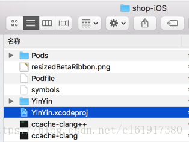
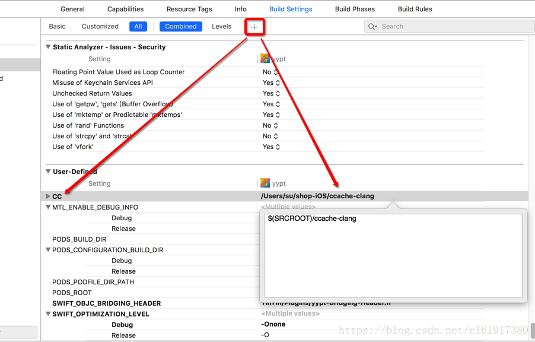
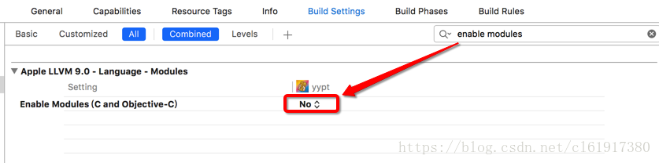
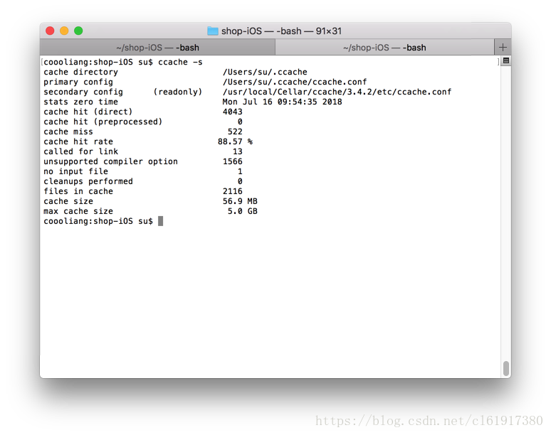

# Mac Xcode中使用ccache加快项目编译速度

`转载` `2018-07-16 10:54:52`

内容转载自 [https://www.jianshu.com/p/b61f182f75d2](https://www.jianshu.com/p/b61f182f75d2)

1.安装ccache

```bash
$ brew install ccache
```


2.创建ccache-clang文件

```bash
#!/bin/sh
if type -p ccache >/dev/null 2>&1; then
  export CCACHE_MAXSIZE=10G
  export CCACHE_CPP2=true
  export CCACHE_HARDLINK=true
  export CCACHE_SLOPPINESS=file_macro,time_macros,include_file_mtime,include_file_ctime,file_stat_matches
  
  # 指定日志文件路径到桌面，等下排查集成问题有用，集成成功后删除，否则很占磁盘空间
  export CCACHE_LOGFILE='~/Desktop/CCache.log'
  exec ccache /usr/bin/clang "$@"
else
  exec clang "$@"
fi
```


3.创建ccache-clang++文件

```bash
#!/bin/sh
if type -p ccache >/dev/null 2>&1; then
  export CCACHE_MAXSIZE=10G
  export CCACHE_CPP2=true
  export CCACHE_HARDLINK=true
  export CCACHE_SLOPPINESS=file_macro,time_macros,include_file_mtime,include_file_ctime,file_stat_matches
  
  # 指定日志文件路径到桌面，等下排查集成问题有用，集成成功后删除，否则很占磁盘空间
  export CCACHE_LOGFILE='~/Desktop/CCache.log'
  exec ccache /usr/bin/clang++ "$@"
else
  exec clang++ "$@"
fi
```


4.对文件授权（文件放在项目的根目录中） 



```bash
$ chmod 777 ccache-clang++
$ chmod 777 ccache-clang
```


5.在项目中的Build Settings中添加脚本文件路径 



6.关闭Modules 



7.查看缓存使用情况 



查看xcode编译所需时间开关

```bash
defaults write com.apple.dt.Xcode ShowBuildOperationDuration YES
```


