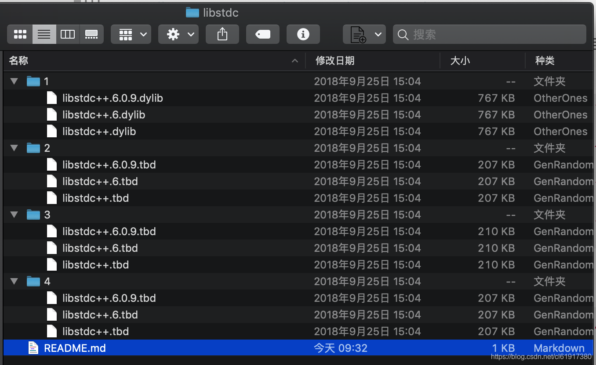

# Xcode10 报错：library not found for -libstdc++.6.0.9

`转载` `2018-11-22 09:36:45`

文件转载自互联网，好像是github…

1.下载资源文件 [https://download.csdn.net/download/cl61917380/10799829](https://download.csdn.net/download/cl61917380/10799829) 

 2.将其中文件夹 1、2、3、4 中的文件分别对应复制到Xcode10中的以下4个目录中即可：

```bash
/Applications/Xcode.app/Contents/Developer/Platforms/iPhoneOS.platform/Developer/Library/CoreSimulator/Profiles/Runtimes/iOS.simruntime/Contents/Resources/RuntimeRoot/usr/lib/

/Applications/Xcode.app/Contents/Developer/Platforms/MacOSX.platform/Developer/SDKs/MacOSX.sdk/usr/lib/

/Applications/Xcode.app/Contents/Developer/Platforms/iPhoneOS.platform/Developer/SDKs/iPhoneOS.sdk/usr/lib/

/Applications/Xcode.app/Contents/Developer/Platforms/iPhoneSimulator.platform/Developer/SDKs/iPhoneSimulator.sdk/usr/lib/
```


3.对应的shell为

```bash
sudo cp /Users/su/Downloads/download_git/libstdc/1/libstdc++.* /Applications/Xcode.app/Contents/Developer/Platforms/iPhoneOS.platform/Developer/Library/CoreSimulator/Profiles/Runtimes/iOS.simruntime/Contents/Resources/RuntimeRoot/usr/lib/

sudo cp /Users/su/Downloads/download_git/libstdc/2/libstdc++.* /Applications/Xcode.app/Contents/Developer/Platforms/MacOSX.platform/Developer/SDKs/MacOSX.sdk/usr/lib/

sudo cp /Users/su/Downloads/download_git/libstdc/3/libstdc++.* /Applications/Xcode.app/Contents/Developer/Platforms/iPhoneOS.platform/Developer/SDKs/iPhoneOS.sdk/usr/lib/

sudo cp /Users/su/Downloads/download_git/libstdc/4/libstdc++.* /Applications/Xcode.app/Contents/Developer/Platforms/iPhoneSimulator.platform/Developer/SDKs/iPhoneSimulator.sdk/usr/lib/
```


其中

```bash
/Users/su/Downloads/download_git/libstdc/ 
```


为我的文件目录

