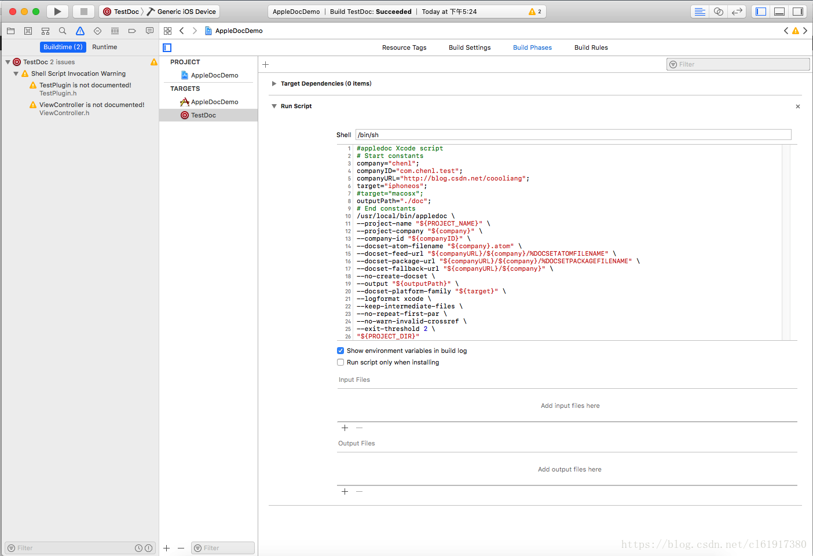
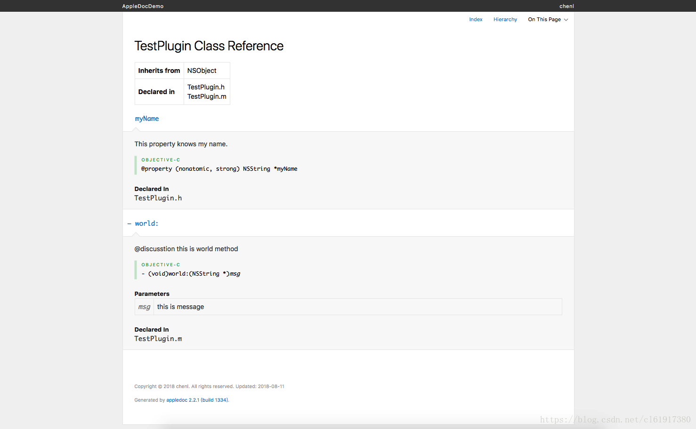

# Xcode中oc代码文档生成

`原创` `2018-08-11 17:34:45`

### 1.安装appledoc


```bash
1.安装brew
$ /usr/bin/ruby -e "$(curl -fsSL https://raw.githubusercontent.com/Homebrew/install/master/install)"

2.安装 appledoc
$ brew install appledoc
```


### 2.查看是否安装成功

```bash
$ appledoc --version
$ appledoc --help
```


### 3.使用命令行生成html文档


```bash
$ cd yourFolder
$ appledoc --project-name ProjectName --project-company companyName --no-create-docset --create-html -output ./```

```

### 4.生成文档方式


在xcode中新建target–>Aggregate–>Build Phases–>Run Script

```bash
#appledoc Xcode script
# Start constants
company="chenl";
companyID="com.chenl.test";
companyURL="http://blog.csdn.net/coooliang";
target="iphoneos";
#target="macosx";
outputPath="./doc";
# End constants
/usr/local/bin/appledoc \
--project-name "${PROJECT_NAME}" \
--project-company "${company}" \
--company-id "${companyID}" \
--docset-atom-filename "${company}.atom" \
--docset-feed-url "${companyURL}/${company}/%DOCSETATOMFILENAME" \
--docset-package-url "${companyURL}/${company}/%DOCSETPACKAGEFILENAME" \
--docset-fallback-url "${companyURL}/${company}" \
--no-create-docset \
--output "${outputPath}" \
--docset-platform-family "${target}" \
--logformat xcode \
--keep-intermediate-files \
--no-repeat-first-par \
--no-warn-invalid-crossref \
--exit-threshold 2 \
"${PROJECT_DIR}"
```






