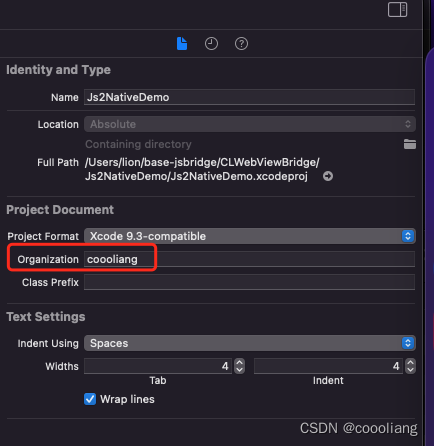

# Xcode新建文件时注释模板设置

`原创` `2023-02-09 11:24:21`

`/Users/lion/Library/Developer/Xcode/UserData`目录中添加`IDETemplateMacros.plist`

**IDETemplateMacros.plist内容如下：**

```
<?xml version="1.0" encoding="UTF-8"?>
<!DOCTYPE plist PUBLIC "-//Apple//DTD PLIST 1.0//EN" "http://www.apple.com/DTDs/PropertyList-1.0.dtd">
<plist version="1.0">
<dict>
    <key>FILEHEADER</key>
    <string>// 
//  ___FILENAME___
//  ___PRODUCTNAME___
//  Created by ___ORGANIZATIONNAME___ on ___DATE___
//  ___COPYRIGHT___
//
//</string>
</dict>
</plist>
```


选中项目，右侧设置Organization 



