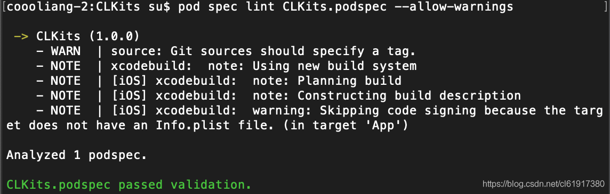
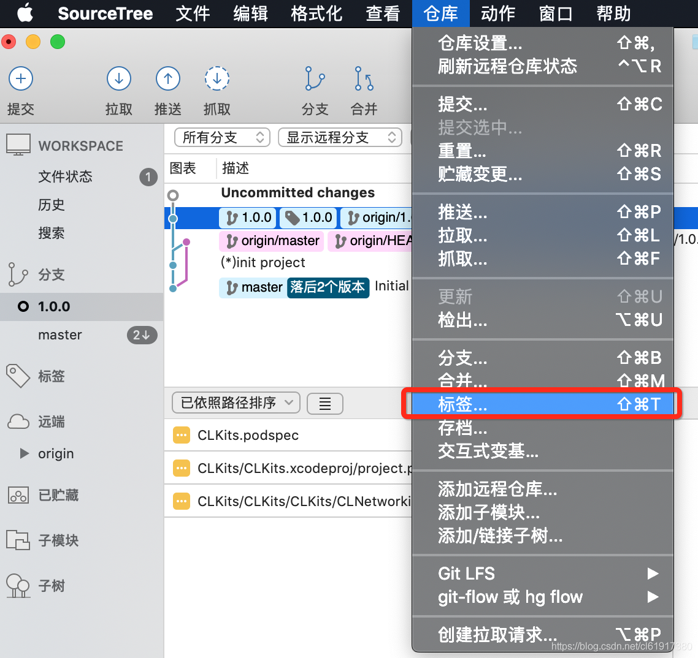
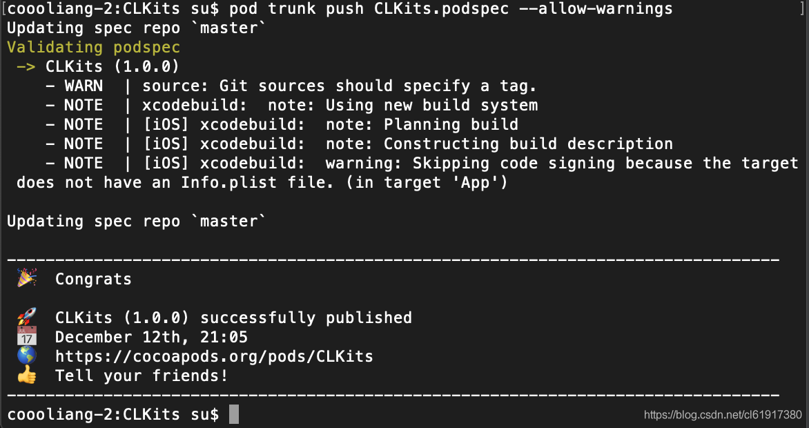
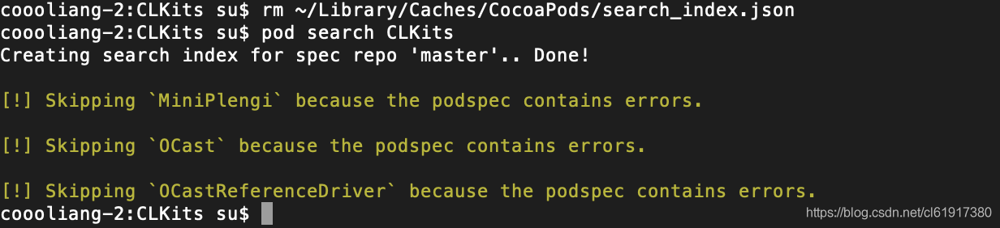
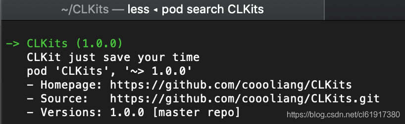

# 如何上传自己的开源项目到Cocoapods

`原创` `2018-12-13 11:25:58`

#### 1.Create File (.podspec):


([https://github.com/coooliang/CLKits/commits/1.0.0](https://github.com/coooliang/CLKits/commits/1.0.0)) 中查看

```
#
#  Be sure to run `pod spec lint CLKits.podspec' to ensure this is a
#  valid spec and to remove all comments including this before submitting the spec.
#
#  To learn more about Podspec attributes see https://docs.cocoapods.org/specification.html
#  To see working Podspecs in the CocoaPods repo see https://github.com/CocoaPods/Specs/
#

Pod::Spec.new do |s|
  s.name         = "CLKits"
  s.version      = "1.0.1"
  s.summary      = "CLKit just save your time"
  s.homepage     = "https://github.com/coooliang/CLKits"
  s.license      = { :type => "MIT", :file => "LICENSE" }
  s.author       = "coooliang"
  s.platform     = :ios, "8.0"
  s.source       = { :git => "https://github.com/coooliang/CLKits.git", :tag => "#{s.version}" }
  s.requires_arc = true

  s.ios.deployment_target = '8.0'
  s.default_subspec = 'All'

  s.subspec 'All' do |all|
    all.source_files = 'Sources/CLFaster/**/*.{h,m}','Sources/CLNetworking/**/*.{h,m}','Sources/CLPopAnimation/**/*.{h,m}'
    all.dependency "AFNetworking", "~> 3.2.1"
    all.dependency "pop", "~> 1.0.12"
    all.ios.frameworks = 'AVFoundation', 'UIKit'
  end


  s.subspec 'CLFaster' do |ss|
    ss.source_files = 'Sources/CLFaster/**/*.{h,m}'
    ss.ios.frameworks = 'UIKit'
  end

  s.subspec 'CLNetworking' do |ss|
    ss.source_files = 'Sources/CLNetworking/**/*.{h,m}'
    ss.dependency "AFNetworking", "~> 3.2.1"
    ss.ios.frameworks = 'AVFoundation'
  end

  s.subspec 'CLPopAnimation' do |ss|
    ss.source_files = 'Sources/CLPopAnimation/**/*.{h,m}'
    ss.dependency "pop", "~> 1.0.12"
    ss.ios.frameworks = 'UIKit'
  end

end

```


#### 2.Validate Project:


```
忽略警告
pod spec lint CLKits.podspec --allow-warnings
或者
pod spec lint CLKits.podspec --verbose
```


验证成功： 



#### 3.Push to Cocoapods


添加pod账号

```bash
pod trunk register name@example.org 'Your Name' --description='macbook pro'
```


PS:需要添加一个tag在你对应的分支 



```bash
pod trunk push CLKits.podspec --allow-warnings
```





#### 4.成功后更新库并查看


```bash
//pod setup
rm ~/Library/Caches/CocoaPods/search_index.json
pod search CLKits
```



 



