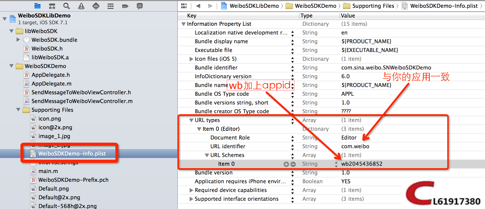
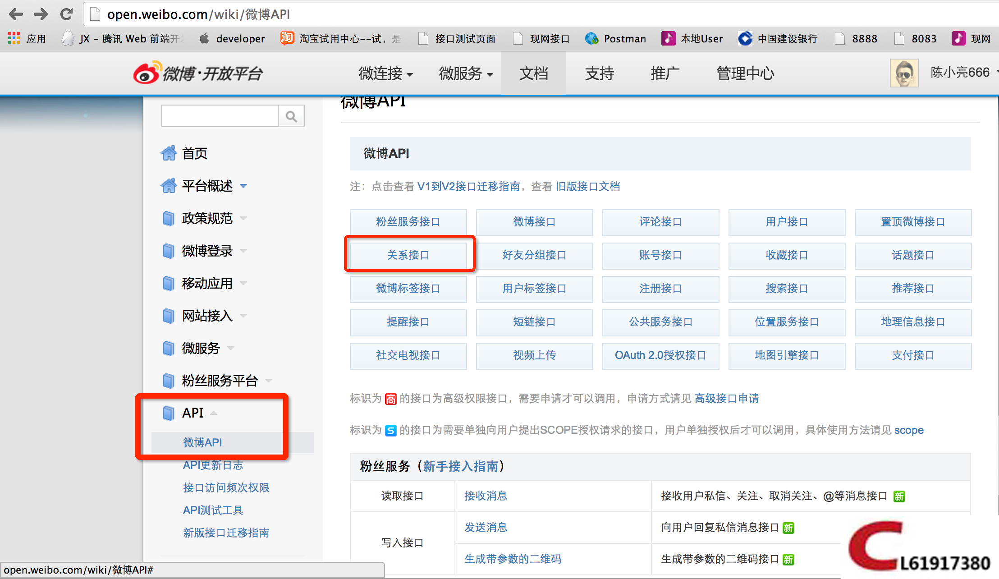

# 新浪微博发送消息和授权机制原理（WeiboSDK）

`原创` `2014-06-28 22:58:38`

1.首先是在微博发送消息，对于刚开始做weibo发送消息的初学者会有一个误区，那就是会认为需要授权后才可以发送消息，其实发送消息只需要几行代码就可以实现了，非常简单，**不需要先授权再发送消息**，因为weibosdk已经帮我们封装好了。（此情况需要用户安装客户端）

发送消息流程为：点击发送消息按键----SDK会自动帮我们判断用户是否安装了新浪微博客户端--如果未安装弹出安装提示----如果安装直接跳转到sina微博客户端进行发送----发送成功后自动跳回原应用程序。

1)在AppDelegate中注册sdk, AppDelegate需要实现WeiboSDKDelegate


```objectivec
AppDelegate.h
@interface AppDelegate : UIResponder <UIApplicationDelegate, WeiboSDKDelegate>
{...
```

```objectivec
AppDelegate.m

- (BOOL)application:(UIApplication *)application didFinishLaunchingWithOptions:(NSDictionary *)launchOptions
{
    //注册SDK
    [WeiboSDK enableDebugMode:YES];
    [WeiboSDK registerApp:kAppKey];

- (BOOL)application:(UIApplication *)application openURL:(NSURL *)url sourceApplication:(NSString *)sourceApplication annotation:(id)annotation
{
    return [WeiboSDK handleOpenURL:url delegate:self];
}
```

2)拼接消息对象WBMessageObject，并发送消息[WeiboSDK  sendRequest:request];

```objectivec
WBSendMessageToWeiboRequest *request = [WBSendMessageToWeiboRequest requestWithMessage:[self messageToShare]];
    request.userInfo = @{@"ShareMessageFrom": @"SendMessageToWeiboViewController",
                         @"Other_Info_1": [NSNumber numberWithInt:123],
                         @"Other_Info_2": @[@"obj1", @"obj2"],
                         @"Other_Info_3": @{@"key1": @"obj1", @"key2": @"obj2"}};
    //    request.shouldOpenWeiboAppInstallPageIfNotInstalled = NO;
    
    [WeiboSDK sendRequest:request];//这句就可以发送消息了，不需要先授权
```

```objectivec
- (WBMessageObject *)messageToShare
{
    WBMessageObject *message = [WBMessageObject message];
    
    if (self.textSwitch.on)
    {
        message.text = @"测试通过WeiboSDK发送文字到微博!";
    }
    
    if (self.imageSwitch.on)
    {
        WBImageObject *image = [WBImageObject object];
        image.imageData = [NSData dataWithContentsOfFile:[[NSBundle mainBundle] pathForResource:@"image_1" ofType:@"jpg"]];
        message.imageObject = image;
    }

    if (self.mediaSwitch.on)
    {
        WBWebpageObject *webpage = [WBWebpageObject object];
        webpage.objectID = @"identifier1";
        webpage.title = @"分享网页标题";
        webpage.description = [NSString stringWithFormat:@"分享网页内容简介-%.0f", [[NSDate date] timeIntervalSince1970]];
        webpage.thumbnailData = [NSData dataWithContentsOfFile:[[NSBundle mainBundle] pathForResource:@"image_2" ofType:@"jpg"]];
        webpage.webpageUrl = @"http://sina.cn?a=1";
        message.mediaObject = webpage;
    }
    
    return message;
}
```


**重要：如果程序发送完消息无法跳回原应用的话是因为在plist文件中没有配置URL Types，appKey在你的新浪开发者帐号里有。**



 

2.授权，通过授权我们可以在用户未安装客户端的情况下关注指定微博。

授权主要是为了得到：userID,accessToken，有了accessToken我们就可以访问新浪weibo的API了http://open.weibo.com/wiki/%E5%BE%AE%E5%8D%9AAPI



 

response.userInfo对象就是我们要的东西

```objectivec
#import <UIKit/UIKit.h>

@interface SinaWeiBoLoginViewController : UIViewController<UIWebViewDelegate>{
    UIWebView *_webView;
    void (^_completionHandler)(BOOL);
    BOOL loadSuccess;
}
@property (nonatomic, copy)void (^completionHandler)(BOOL);
@property (nonatomic)BOOL loadSuccess;

- (id)initWithLoginCompletion:(void (^) (BOOL isLoginSuccess))isLoginSuccess;
- (void)startRequest;
@end
```


```objectivec
//
//  SinaWeiBoLoginViewController.m
//  YinYin
//
//  Created by Lw. on 14-7-3.
//
//

#import "SinaWeiBoLoginViewController.h"
#import "SinaUtil.h"
#import "SVProgressHUD.h"

#define title_height ((!IS_IOS_7)?40:60)

@interface SinaWeiBoLoginViewController ()

@end

@implementation SinaWeiBoLoginViewController

@synthesize completionHandler,loadSuccess;

- (id)initWithLoginCompletion:(void (^) (BOOL isLoginSuccess))isLoginSuccess
{
    if (self = [super init]) {
        self.completionHandler = isLoginSuccess;
    }
    return self;
}

- (void)dealloc
{
    [_webView release];
    [super dealloc];
}

- (void)viewDidLoad {
    [super viewDidLoad];
    [self.view setBackgroundColor:[UIColor whiteColor]];
    //自定义导航
    UIView *customNavBar = [[UIView alloc] initWithFrame:CGRectMake(0, 0, 320, title_height)];
    customNavBar.backgroundColor = [UIColor blackColor];
    [self.view addSubview:customNavBar];
    [customNavBar release];
    
    UIButton *returnBtn = [UIButton buttonWithType:UIButtonTypeCustom];
    [returnBtn setTitle:@"取消" forState:UIControlStateNormal];
    returnBtn.titleLabel.font = [UIFont systemFontOfSize:15];
    returnBtn.frame = CGRectMake(7, (!IS_IOS_7)?5:20, 50, 30);
    [returnBtn addTarget:self action:@selector(Cancelbtn) forControlEvents:UIControlEventTouchUpInside];
    [customNavBar addSubview:returnBtn];
    
	_webView = [[UIWebView alloc] initWithFrame:CGRectMake(0,title_height, self.view.frame.size.width, self.view.frame.size.height - title_height)];
	_webView.delegate = self;
	[self.view addSubview:_webView];
    [_webView release];
    [self startRequest];
}

-(void)Cancelbtn
{
    _webView.delegate = nil;
    if(self.completionHandler)
    {
        self.completionHandler(NO);
    }
    [self dismissViewControllerAnimated:YES completion:nil];
}


#pragma mark - 请求网络

-(void)startRequest{
	NSURLRequest *request = [[NSURLRequest alloc] initWithURL:[SinaUtil authorizeURL]];
	[_webView loadRequest:request];
}


#pragma mark - UIWebView代理方法
- (void)webViewDidStartLoad:(UIWebView *)webView{
    [SVProgressHUD show];
}
- (void)webViewDidFinishLoad:(UIWebView *)webView{
    [SVProgressHUD dismiss];
}
-(void)webView:(UIWebView *)webView didFailLoadWithError:(NSError *)error{
    [SVProgressHUD dismiss];
}
- (BOOL)webView:(UIWebView *)webView shouldStartLoadWithRequest:(NSURLRequest *)request navigationType:(UIWebViewNavigationType)navigationType{
    if ([request.URL.absoluteString rangeOfString:@"code="].location != NSNotFound) {
        NSString *code = [[request.URL.query componentsSeparatedByString:@"="] objectAtIndex:1];
        loadSuccess = YES;
        if([SinaUtil getAccessToken:code]){
            if([SinaUtil sinaAtt]){
                [self dismissViewControllerAnimated:YES completion:^{
                    [SVProgressHUD showSuccessWithStatus:@"关注成功"];
                }];
            }else{
                [SVProgressHUD showErrorWithStatus:@"关注失败"];
            }
        }else{
            [SVProgressHUD showErrorWithStatus:@"授权失败"];
        }
        return NO;
    }
    return YES;
}
-(void)viewDidDisappear:(BOOL)animated{
    [SVProgressHUD dismiss];
}
-(void)viewDidUnload{
    [SVProgressHUD dismiss];
}
@end
```

```objectivec
#import <Foundation/Foundation.h>
#import "WeiboSDK.h"
#import "EnvConstant.h"
#import "ASIHTTPRequest.h"

@class ShareMultiple;


@interface SinaUtil : NSObject<WBHttpRequestDelegate>


+(void)share:(NSString *)text imageData:(UIImage *)imageData imageUrl:(NSString *)imageUrl url:(NSString *)url urlTitle:(NSString *)urlTitle urlDesc:(NSString *)urlDesc urlThumbdata:(UIImage *)urlThumbdata;

#pragma mark - public method
+(void)evaluatingJavaScriptFromString:(id)userInfo;

+(void)timerFireMethod:(NSTimer*)theTimer;

+(BOOL) startWith:(NSString*)prefix forString:(NSString*)text;
+(BOOL) stringEquals:(NSString*)str1 to:(NSString*)str2;

#pragma mark - 关注功能
/**
 *	授权地址
 *
 *	@return     UIWebView所要加载的url
 */
+ (NSURL *)authorizeURL;
+ (BOOL)getAccessToken:(NSString *)code;
+(BOOL)sinaAtt;
+(BOOL)isAuthorized;
+(void)saveLoginInfo:(NSDictionary *)aDic;

@end
```

```objectivec
#import "SinaUtil.h"
#import "EnvConstant.h"
#import "AppDelegate.h"
#import "WXApiObject.h"
#import "ASIHTTPRequest.h"
#import "SVProgressHUD.h"
#import "ASIHTTPRequest.h"
#import "ASIFormDataRequest.h"
#import "SBJSON.h"

@implementation SinaUtil

//3.发布媒体,只能文字图片，文字媒体，无法文字图片媒体
+(void)share:(NSString *)text imageData:(UIImage *)imageData imageUrl:(NSString *)imageUrl url:(NSString *)url urlTitle:(NSString *)urlTitle urlDesc:(NSString *)urlDesc urlThumbdata:(UIImage *)urlThumbdata{
    
    WBMessageObject *message = [WBMessageObject message];
    //1.文本
    if(text != nil){
        message.text = text;
    }
    //2.图片和超链接
    if(imageData != nil){
        WBImageObject *imageObj = [WBImageObject object];
        imageObj.imageData = UIImagePNGRepresentation(imageData);
        message.imageObject = imageObj;
    }else if (imageUrl != nil){
        if([@"http://www.yypt.com/home/resources/images/activity/weiboshare.jpg" isEqualToString:imageUrl]){
            WBImageObject *imageObj = [WBImageObject object];
            imageObj.imageData = UIImagePNGRepresentation([UIImage imageNamed:@"weiboshare.jpg"]);
            message.imageObject = imageObj;
        }else{
            //message.text = [NSString stringWithFormat:@"%@%@",message.text,imageUrl];
        }
}
    //3.媒体
    if(url != nil){
        WBWebpageObject *webpage = [WBWebpageObject object];
        webpage.objectID = @"identifier1";
        webpage.title = urlTitle;
        webpage.description = urlDesc;
        webpage.thumbnailData = UIImagePNGRepresentation(urlThumbdata);
        webpage.webpageUrl = url;
        message.mediaObject = webpage;
    }
    WBSendMessageToWeiboRequest *request = [WBSendMessageToWeiboRequest requestWithMessage:message];
    [WeiboSDK sendRequest:request];
}

#pragma mark - WBHttpRequestDelegate
- (void)request:(WBHttpRequest *)request didFinishLoadingWithResult:(NSString *)result{
    //收到网络回调
}

- (void)request:(WBHttpRequest *)request didFailWithError:(NSError *)error;{
    //请求异常
}

#pragma mark - public method
//执行脚本
+(void)evaluatingJavaScriptFromString:(id)userInfo{
    [NSTimer scheduledTimerWithTimeInterval:0.01 target:self selector:@selector(timerFireMethod:) userInfo:userInfo repeats:NO];
}
//timer回调，0成功，1失败，2取消
+(void)timerFireMethod:(NSTimer*)theTimer{
    if([theTimer.userInfo isKindOfClass:[SendMessageToWXResp class]]){
        SendMessageToWXResp* response = (SendMessageToWXResp *)theTimer.userInfo;
        int d = 0;
        switch (response.errCode) {
            case WXSuccess:
                d = 0;
                break;
            case WXErrCodeUserCancel:
                d = 2;
                break;
            default:
                d = 1;
                break;
        }
        NSString* jsString = @"$(document).trigger('shareResultEvent',['%d'])";
        AppDelegate *appDelegate = (AppDelegate *)[[UIApplication sharedApplication]delegate];
        [appDelegate.viewController.webView stringByEvaluatingJavaScriptFromString:[NSString stringWithFormat:jsString,d]];//这里的errcode不同于weibo的statusCode
        
    }else if([theTimer.userInfo isKindOfClass:[WBBaseResponse class]]){
        WBBaseResponse* response = (WBBaseResponse *)theTimer.userInfo;
        int d = 0;
        switch (response.statusCode) {
            case WeiboSDKResponseStatusCodeSuccess:
                d = 0;
                break;
            case WeiboSDKResponseStatusCodeUserCancel:
                d = 2;
                break;
            default:
                d = 1;
                break;
        }

        NSString* jsString = @"$(document).trigger('shareResultEvent',['%d'])";
        AppDelegate *appDelegate = (AppDelegate *)[[UIApplication sharedApplication]delegate];
        [appDelegate.viewController.webView stringByEvaluatingJavaScriptFromString:[NSString stringWithFormat:jsString,d]];
    }
    

}
#pragma mark - string
+(BOOL) startWith:(NSString*)prefix forString:(NSString*)text{
    if ( text != nil && prefix != nil ){
        if ( [prefix length] > [text length] ) {
            return NO;
        }
        
        NSString* prestr = [text substringToIndex:[prefix length]];
        if ( [self stringEquals:prestr to:prefix] ) {
            return YES;
        }
        
    }
    return NO;
}
+(BOOL) stringEquals:(NSString*)str1 to:(NSString*)str2
{
    if ( str1 == nil || str2 == nil ) {
        return NO;
    }
    return [str1 compare:str2 options:NSCaseInsensitiveSearch] == NSOrderedSame;
}

#pragma mark - 关注功能
/**
 *	授权地址
 *
 *	@return     UIWebView所要加载的url
 */
+ (NSURL *)authorizeURL
{
    NSString *authStr = [NSString stringWithFormat:@"%@?client_id=%@&redirect_uri=%@&response_type=%@&display=%@",SINA_AUTHORIZE_URL,kWBSDKDemoAppKey,wbkRedirectURI,@"code",@"mobile"];
    return [NSURL URLWithString:authStr];
}

/**
 *	获取AccessToken
 *
 *	@param	code        在webView的重定向地址中取得code
 *  @param  isSuccess   block 请求成功的回调
 *                      BOOL  isSuccess 请求是否成功 YES or NO
 */
+ (BOOL)getAccessToken:(NSString *)code{
    NSURL *url = [NSURL URLWithString:[HOSTURL stringByAppendingString:@"/oauth2/access_token"]];
    ASIFormDataRequest *request = [[ASIFormDataRequest alloc]initWithURL:url];
    [request addPostValue:kWBSDKDemoAppKey forKey:@"client_id"];
    [request addPostValue:kWBSDKDemoAppSecret forKey:@"client_secret"];
    [request addPostValue:@"authorization_code" forKey:@"grant_type"];
    [request addPostValue:code forKey:@"code"];
    [request addPostValue:wbkRedirectURI forKey:@"redirect_uri"];
    [request setRequestMethod:@"POST"];
    [SVProgressHUD show];
    [request startSynchronous];

    NSError *err = [request error];
    BOOL flag = NO;
    if (!err) {
        NSString *responseString = [request responseString];
        NSLog(@"responseString = %@", responseString);
        if ([responseString rangeOfString:@"access_token"].location != NSNotFound) {
            SBJSON *json = [[SBJSON alloc] init];
            NSDictionary *jsonDic = [json objectWithString:responseString];
            [SinaUtil saveLoginInfo:jsonDic];
        }
        flag = YES;
    }else{
        flag = NO;
    }
    [SVProgressHUD dismiss];
    return flag;
}

//关注微博
+(BOOL)sinaAtt{
    NSString *accessToken = [[NSUserDefaults standardUserDefaults] objectForKey:SINA_ACCESS_TOKEN_KEY];
    NSString *path = @"/2/friendships/create.json";
    NSString *requestUrl = [HOSTURL stringByAppendingString:path];
    NSLog(@"requestUrl = %@",requestUrl);
    ASIFormDataRequest *request = [[ASIFormDataRequest alloc] initWithURL:[NSURL URLWithString:requestUrl]];
    [request addPostValue:accessToken forKey:@"access_token"];
    [request addPostValue:ATTENTION_SINA_WEIBO_NUM forKey:@"uid"];
    [request addPostValue:ATTENTION_SINA_WEIBO_SCREEN_NAME forKey:@"screen_name"];
    [request startSynchronous];
    request.timeOutSeconds = 6;
    NSError *error = [request error];
    BOOL flag = NO;
    if(error!=nil){
        flag = NO;
    }else{
        flag = YES;
    }
    return flag;
}

/**
 *	判断有没有登录过，并且获得到的token有没有过期
 *
 *	@return     YES 有可用的token ，并且没有过期; NO 没有可用的token
 */
+(BOOL)isAuthorized{
    NSUserDefaults *userDef = [NSUserDefaults standardUserDefaults];
    NSString *accessToken = [userDef objectForKey:SINA_ACCESS_TOKEN_KEY];
    NSDate *expiresDate = [userDef objectForKey:SINA_ACCESS_EXPIRES_IN_KEY];
    if (expiresDate){
        return (NSOrderedDescending == [expiresDate compare:[NSDate date]] && accessToken);
    }
    return NO;
}

/**
 *	保存登录信息
 *
 *	@param	aDic	字典中有access_token，exoires_in，uid等信息
 */
+(void)saveLoginInfo:(NSDictionary *)aDic{
    NSLog(@"保存token...");
    [[NSUserDefaults standardUserDefaults] setObject:[aDic objectForKey:@"access_token"] forKey:SINA_ACCESS_TOKEN_KEY];
    NSDate *expiresDate = [NSDate dateWithTimeIntervalSinceNow:[[aDic objectForKey:@"expires_in"] intValue]];
    [[NSUserDefaults standardUserDefaults] setObject:expiresDate forKey:SINA_ACCESS_EXPIRES_IN_KEY];
    [[NSUserDefaults standardUserDefaults] setObject:[aDic objectForKey:@"uid"] forKey:SINA_USER_ID_KEY];
    [[NSUserDefaults standardUserDefaults] synchronize];
}

@end
```

调用方式： 

```objectivec
if([SinaUtil isAuthorized]){
                if([SinaUtil sinaAtt]){
                    [SVProgressHUD showSuccessWithStatus:@"关注成功"];
                }else{
                    [SVProgressHUD showErrorWithStatus:@"关注失败"];
                }
            }else{
                //[self selectRow:@"follow-wb"];
                SinaWeiBoLoginViewController *sinaVC = [[SinaWeiBoLoginViewController alloc]init];
                [self presentViewController:sinaVC animated:YES completion:nil];
            }
```


 

 

 

 

 

 

 

 


  

