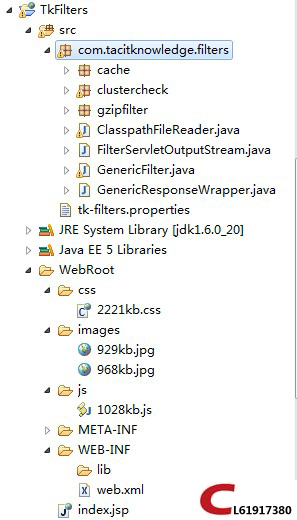
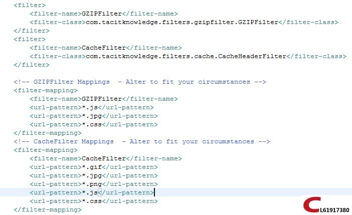
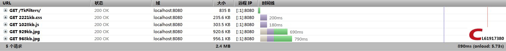
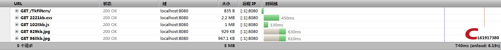

# GZIP实现工程速度提升之HelloWorld（Tk-Filters）

`原创` `2013-05-25 12:14:33`

PS:首先我要在这里感谢sourceforge，以及无私贡献代码的人。你们真是伟大。向你们学习。

你是不是因为工程中引入大量的JS,JPG，CSS导致速度加载很慢。那么TK-Filters就是你的福音了。

Tk-Filters下载地址：http://download.csdn.net/detail/cl61917380/5449741（聪明的人会Google） 

1.将下载下来的Tk-Filters工程中的src源代码以及tk-filters.properties放到你WEB工程中的src目录下，然后修改web.xml添加过滤器，就是这么简单。

2.在tk-filters.properties中开启你想要使用的过滤器。例如：GZIPFilter.Enabled=true 或者CacheFilter.Enabled=true

相关的图片在下方，我想你们一看就能明白，不明白的完全可以留言。





下面是我测试的结果，以证明这个框架是可以使用的：

上图中CSS,JPG,JS文件名分别表示他们的文件大小，例如:1028kb.js这个文件的实际大小就是1028kb啦！

当在tk-filters.properties中关闭GZIP功能的时候（GZIPFilter.Enabled=false），通过firefox浏览器的**firebug**插件可以很容易的看到加载文件的大小。

未开启GZIP功能之前浏览器加载文件大小与速度（1028kb.js文件浏览器显示下载的大小为1MB）：


 
开启GZIP功能之后浏览器加载文件大小与速度（1028kb.js文件浏览器显示下载的大小为303.5KB）：



JSP：

```
	<link rel="stylesheet" type="text/css" href="<%=path%>/css/2221kb.css">
	<script type="text/javascript" src="<%=path%>/js/1028kb.js"></script>
  </head>
  
  <body>
    /images/929kb.jpg"/>
    /images/968kb.jpg"/>
  </body>
```

2.还有更方便的方法，直接配置tomcat：

转载自：http://www.cnblogs.com/codewater/articles/2228594.html

打开conf/server.xml文件可以看到：

```xml
<!-- Define a non-SSL HTTP/1.1 Connector on port 8080 -->  
<Connector port="8080" maxHttpHeaderSize="8192"  maxThreads="150" minSpareThreads="25" maxSpareThreads="75"  
           enableLookups="false" redirectPort="8443" acceptCount="100"  connectionTimeout="20000" disableUploadTimeout="true" />  
<!-- Note : To disable connection timeouts, set connectionTimeout value to 0 --> 
<!-- Note : To use gzip compression you could set the following properties : compression="on"   compressionMinSize="2048" noCompressionUserAgents="gozilla, traviata"   compressableMimeType="text/html,text/xml" -->
```


要使用gzip压缩功能，可以在Connector实例中加上如下属性:  1) compression="on" 打开压缩功能 2) compressionMinSize="2048" 启用压缩的输出内容大小，这里面默认为2KB 3) noCompressionUserAgents="gozilla, traviata" 对于以下的浏览器，不启用压缩&<60; 4) compressableMimeType="text/html,text/xml" 压缩类型

 修改完成后
```xml
<Connector port="8080" maxHttpHeaderSize="8192" maxThreads="150" minSpareThreads="25" maxSpareThreads="75" enableLookups="false" 
           redirectPort="8443" acceptCount="100"  connectionTimeout="20000" disableUploadTimeout="true" compression="on" 
           compressionMinSize="2048" noCompressionUserAgents="gozilla,traviata" 
           compressableMimeType="text/html,text/xml,text/javascript,text/css,text/plain" />
```
即在Connector里面增加红色部分即可。
