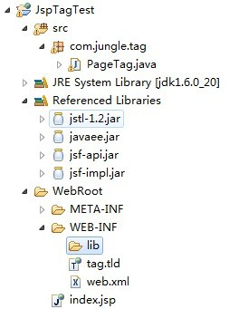

# JSP自定义标签（EL表达式问题和TLD文件说明）

`原创` `2013-04-06 23:38:40`


首先说明这是一个HelloWorld程序。

解决的问题有：1.工程中无法使用EL表达式处理; 2.TLD应如何定义; 3.自定义一个JSP标签

 

**1.EL表达式无法使用**

****(我使用的是今天晚上刚下载的tomcat.6.0.36版本，不过这个问题和tomcat版本没有关系)

1)之前总会出现的问题。我原来的解决方法是将web.xml文件中的版本号由2.5修改为2.4

例如：

```xml
<web-app version="2.4" 
			   xmlns="http://java.sun.com/xml/ns/javaee" 
				 xmlns:xsi="http://www.w3.org/2001/XMLSchema-instance" 
				 xsi:schemaLocation="http://java.sun.com/xml/ns/javaee 
				 http://java.sun.com/xml/ns/javaee/web-app_2_4.xsd">
```

但是这样感觉不大好。

2）现解决方法是将JAVA EE 5 Libraries中的JAR包**复制到工程中的lib目录下**就解决了这个问题。

（我的下载地址：http://download.csdn.net/detail/cl61917380/5227429）




**2.TLD应如何定义**

1）如上图，将tag.tld文件复制到WEB-INF目录下。

2）有的人问如何可以找到官方的TLD文件定义的格式。其实只要在**文档头部添加xsd**，告诉IDE我的XML应该如何定义就行了，这样在写XML文件的时候IDE会给我们提示。

```xml
<?xml version="1.0" encoding="UTF-8"?>
<taglib xmlns="http://java.sun.com/xml/ns/javaee"
    xmlns:xsi="http://www.w3.org/2001/XMLSchema-instance"
    xsi:schemaLocation="http://java.sun.com/xml/ns/javaee http://java.sun.com/xml/ns/javaee/web-jsptaglibrary_2_1.xsd"
    version="2.1">
    
	<tlibversion>1.0</tlibversion>
	<jspversion>1.1</jspversion>
	<tag>
		<name>tag</name>
		<tagclass>com.coooliang.tag.PageTag</tagclass>
		<bodycontent>empty</bodycontent>
		<!-- 定义属性 -->
		<attribute>
			<name>currentPage</name><!-- 属性名字 -->
			<type>int</type><!-- 属性类型 -->
			<required>true</required><!-- 是否必须 -->
			<rtexprvalue>true</rtexprvalue><!-- 支持EL表达式 -->
		</attribute>
		<attribute>
			<name>pageCount</name><!-- 属性名字 -->
			<type>int</type><!-- 属性类型 -->
		</attribute>
	</tag>
</taglib>
```

**3.创建标签类**

```java
public class PageTag extends TagSupport {
	private int currentPage = 1;
	private int pageCount = 10;

	@Override
	public int doStartTag() throws JspException {
		ServletResponse resp = this.pageContext.getResponse();
		try {
			PrintWriter writer = resp.getWriter();
			writer.print("doStartTag()..." + "currentPage = " + currentPage + " pageCount = " + pageCount);
			writer.flush();
			writer.close();
		} catch (IOException e) {
			e.printStackTrace();
		}
		return super.doStartTag();
	}

	public int getCurrentPage() {
		return currentPage;
	}

	public void setCurrentPage(int currentPage) {
		this.currentPage = currentPage;
	}

	public int getPageCount() {
		return pageCount;
	}

	public void setPageCount(int pageCount) {
		this.pageCount = pageCount;
	}

}
```

JSP页面： 

```jsp
<%@ page language="java" import="java.util.*" pageEncoding="GBK"%>
<%@ taglib uri="/WEB-INF/tag.tld" prefix="pt"%><!--引入自定义标签-->
<%@ taglib prefix="c" uri="http://java.sun.com/jsp/jstl/core" %><!--这里用的是1.2的uri，1.1的uri是http://java.sun.com/jstl/core 我用这两个uri页面都正常-->
<%
	 request.setAttribute("currentPage",3);//当前页
	 request.setAttribute("content","查询关键字");//查询关键字
%>
         <pt:tag currentPage="${currentPage}" pageCount="123"/>
<br>
```
