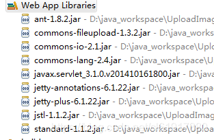

# Java Servlet实现文件上传并读取Zip压缩包中文件的真实类型

`原创` `2018-12-17 11:19:32`

#### 1.上传文件servlet

PS: 使用ant.jar中的 org.apache.tools.zip.ZipEntry 对象，防止乱码

```java
package com.chenl.servlets;

import java.io.File;
import java.io.IOException;
import java.io.InputStream;
import java.io.PrintWriter;
import java.text.SimpleDateFormat;
import java.util.Arrays;
import java.util.Date;
import java.util.Enumeration;
import java.util.List;

import javax.servlet.ServletException;
import javax.servlet.annotation.WebServlet;
import javax.servlet.http.HttpServlet;
import javax.servlet.http.HttpServletRequest;
import javax.servlet.http.HttpServletResponse;

import org.apache.commons.fileupload.FileItem;
import org.apache.commons.fileupload.disk.DiskFileItemFactory;
import org.apache.commons.fileupload.servlet.ServletFileUpload;
import org.apache.tools.zip.ZipEntry;
import org.apache.tools.zip.ZipFile;

import com.chenl.util.FileType;
import com.chenl.util.FileUtil;

/**
 * Servlet implementation class UploadServlet
 */
@WebServlet("/UploadServlet")
public class UploadServlet extends HttpServlet {
	private static final long serialVersionUID = 1L;

	// 上传文件存储目录
	private static final String UPLOAD_DIRECTORY = "upload";

	// 上传配置
	private static final int MEMORY_THRESHOLD = 1024 * 1024 * 3; // 3MB
	private static final int MAX_FILE_SIZE = 1024 * 1024 * 40; // 40MB
	private static final int MAX_REQUEST_SIZE = 1024 * 1024 * 50; // 50MB

	private static String today;
	private static int iosCount;
	private static int androidCount;

	/**
	 * 上传数据及保存文件
	 */
	protected void doPost(HttpServletRequest request, HttpServletResponse response) throws ServletException, IOException {
		// 检测是否为多媒体上传
		if (!ServletFileUpload.isMultipartContent(request)) {
			// 如果不是则停止
			PrintWriter writer = response.getWriter();
			writer.println("Error: 表单必须包含 enctype=multipart/form-data");
			writer.flush();
			return;
		}

		// 配置上传参数
		DiskFileItemFactory factory = new DiskFileItemFactory();
		// 设置内存临界值 - 超过后将产生临时文件并存储于临时目录中
		factory.setSizeThreshold(MEMORY_THRESHOLD);
		// 设置临时存储目录
		factory.setRepository(new File(System.getProperty("java.io.tmpdir")));

		ServletFileUpload upload = new ServletFileUpload(factory);

		// 设置最大文件上传值
		upload.setFileSizeMax(MAX_FILE_SIZE);

		// 设置最大请求值 (包含文件和表单数据)
		upload.setSizeMax(MAX_REQUEST_SIZE);

		// 中文处理
		upload.setHeaderEncoding("UTF-8");

		// 构造临时路径来存储上传的文件
		// 这个路径相对当前应用的目录
		String uploadPath = request.getServletContext().getRealPath("./") + File.separator + UPLOAD_DIRECTORY;
		String userAgent = request.getHeader("user-agent").toLowerCase();
		String ip = request.getRemoteAddr();

		// 如果目录不存在则创建
		File uploadDir = new File(uploadPath);
		if (!uploadDir.exists()) {
			uploadDir.mkdir();
		}

		try {
			List<FileItem> formItems = upload.parseRequest(request);
			if (formItems != null && formItems.size() > 0) {
				for (FileItem item : formItems) {
					if (!item.isFormField()) {
						String fileName = new File(item.getName()).getName();
						String extName = fileName.substring(fileName.lastIndexOf("."));// 获取文件的后缀名

						fileName = validateUserAgent(userAgent, fileName, extName);
						if (fileName == null) {
							throw new Exception("userAgent error : " + fileName);
						}

						boolean simpleValidate = simpleExtValidate(extName);
						if (simpleValidate == false) {
							throw new Exception("ext error " + fileName);
						}

						String filePath = uploadPath + File.separator + fileName;
						File storeFile = new File(filePath);
						System.out.println(filePath);
						// 保存文件到硬盘
						item.write(storeFile);
						
						
						boolean result = validateRealFileType(fileName);
						if (!result) {
							File file = new File("D:\\java_workspace\\UploadImagesDemo\\WebContent\\upload\\" + fileName);
							file.delete();
							System.out.println("del file: " + fileName);
							throw new IOException("validate error " + fileName);
						}
					}
				}
				// request.setAttribute("message",
				// "{'code':'0','message':'success'}");
				response.setContentType("application/json");
				response.getWriter().print("{\"files\":[{}]}");
				response.getWriter().flush();
				response.getWriter().close();
			}
		} catch (Exception ex) {
			System.out.println(ex);
			printError(ip, ex.getMessage());
			response.getWriter().print("{'code':'200','files':" + ex.getMessage() + "}");
			response.getWriter().flush();
			response.getWriter().close();
		}
	}

	private String validateUserAgent(String userAgent, String fileName, String extName) {
		SimpleDateFormat format = new SimpleDateFormat("yyyyMMdd");
		String timeString = format.format(new Date());
		if (!timeString.equals(today)) {
			today = timeString;
			iosCount = 0;
			androidCount = 0;
		}
		if (userAgent != null) {
			if (userAgent.contains("iphone")) {
				fileName = "ios-" + timeString + "-" + (iosCount++) + extName;
				return fileName;
			} else if (userAgent.contains("android")) {
				fileName = "android-" + timeString + "-" + (androidCount++) + extName;
				return fileName;
			}
		}
		return null;
	}

	private boolean simpleExtValidate(String extName) {
		extName = extName.toLowerCase();
		String[] extArr = { ".png", ".jpg", ".jpeg", ".zip" };
		List<String> extList = Arrays.asList(extArr);
		return extList.contains(extName);
	}
	
	private boolean validateRealFileType(String fileName) throws IOException{
		File file = new File("D:\\java_workspace\\UploadImagesDemo\\WebContent\\upload\\" + fileName);
		FileType type = FileUtil.getType(file);
		List<FileType> types = Arrays.asList(FileType.values());
		if(types.contains(type)){
			if(type == FileType.ZIP){
				boolean pass = true;
				ZipFile zipFile = new ZipFile(file,"gbk");
				Enumeration<ZipEntry> entries = (Enumeration<ZipEntry>) zipFile.getEntries();
				while(entries.hasMoreElements()){
					ZipEntry ze = entries.nextElement();
					if(!ze.isDirectory()){
						byte[] b = new byte[28];
						InputStream input = zipFile.getInputStream(ze);
						if(input != null){
							input.read(b, 0, 28);
							input.close();
							FileType fileType = FileUtil.getType(FileUtil.bytesToHexString(b));
							System.out.println("name= " + ze.getName() + " fileType = "+fileType);
							if(!(fileType == FileType.PNG || fileType == FileType.JPEG)){
								 pass = false;
								 break;
							}
						}else{
							System.err.println("InputStream == null name= " + ze.getName());
						}
					}					
				}
				zipFile.close();
				return pass;
			}else{
				return true;
			}
		}
		return false;
	}

	private void printError(String ip, String msg) {
		SimpleDateFormat format = new SimpleDateFormat("yyyy-MM-dd HH:mm:ss");
		String wg = "ip地址： " + ip + " " + format.format(new Date()) + " " + msg;
		System.err.println(wg);
	}
}
```
#### 2.根据文件头判断文件真实类型

```java
package com.chenl.util;

public enum FileType {
	JPEG("FFD8FF"),
	PNG("89504E47"),
	ZIP("504B0304");
	
	private String value = "";
	private FileType(String value){
		this.value = value;
	}
	public String getValue(){
		return value;
	}
	
	public void setValue(String value){
		this.value = value;
	}
}
```

```java
package com.chenl.util;

import java.io.File;
import java.io.FileInputStream;
import java.io.IOException;
import java.io.InputStream;

public class FileUtil {
	public static String bytesToHexString(byte[] src) {
		StringBuilder buff = new StringBuilder();
		if (src == null || src.length <= 0) {
			return null;
		}
		for (int i = 0; i < src.length; i++) {
			int v = src[i] & 0xFF;
			String hv = Integer.toHexString(v).toUpperCase();
			if (hv.length() < 2) {
				buff.append(0);
			}
			buff.append(hv);
		}
		return buff.toString();
	}

	private static String getFileContent(File file) throws IOException {
		byte[] b = new byte[28];
		InputStream input = new FileInputStream(file);
		input.read(b, 0, 28);
		input.close();
		return bytesToHexString(b);
	}
	
	public static FileType getType(File file) throws IOException {
		String fileHead = getFileContent(file);
		if (fileHead == null || fileHead.length() == 0) {
			return null;
		}
		fileHead = fileHead.toUpperCase();
		FileType[] fileTypes = FileType.values();
		for (FileType fileType : fileTypes) {
			if (fileHead.startsWith(fileType.getValue())) {
				return fileType;
			}
		}
		return null;
	}
	
	public static FileType getType(String fileHead) throws IOException {
		if (fileHead == null || fileHead.length() == 0) {
			return null;
		}
		fileHead = fileHead.toUpperCase();
		FileType[] fileTypes = FileType.values();
		for (FileType fileType : fileTypes) {
			if (fileHead.startsWith(fileType.getValue())) {
				return fileType;
			}
		}
		return null;
	}
}
```

#### 3.所需jar包


