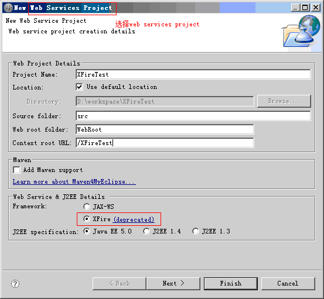

# XFire的HelloWorld

`原创` `2011-11-13 14:33:19`

之前有写过helloworld可是写得很差，我想一定有很多人看不懂。现在我将步骤截图下来

1.创建服务器端，创建一个web Services Project



2.创建一个接口和一个实现类

```java
public interface IWearther {
    /**
     * @return 返回字符串，用于显示天气
     */
    public String wearther();
}

public class IWeartherImpl implements IWearther {

    /**
     * @return 返回字符串，用于显示天气
     */
    public String wearther() {
        String result = "根据一系列处理得到当前天气为阴天!";
        return result;
    }

}
```

3.修改webServices文件夹下的services.xml

```xml
    <service>
        <name>Wearther</name>
        <namespace>www.jungle.com/Weather</namespace><!-- 网站域名+上面节点name -->
        <serviceClass>com.jungle.IWearther</serviceClass><!--  接口 -->
        <implementationClass>
            com.jungle.IWeartherImpl
        </implementationClass><!-- 实现类 -->
    </service>
```

PS：简单的服务器就创建完成了，


4.创建客户端,这里要注意的是创建的是WebProject

首先引入需要的jar包：


5.在客户端创建接口，名称不用和服务器端一样，但是方法要和服务器端一模一样。

```java
public interface IWeartherClient {
    
    /**
     * @return 返回字符串，用于显示天气,方法要和服务器端的方法完全一样。
     */
    public String wearther();
}
```

6.测试类:

```java
 import java.net.MalformedURLException;
 
import org.codehaus.xfire.client.XFireProxyFactory;
import org.codehaus.xfire.service.Service;
import org.codehaus.xfire.service.binding.ObjectServiceFactory;
 
//http://fxk2006.iteye.com/blog/618802
public class TestMain {
    public static void main(String[] args) throws MalformedURLException {
        Service service = new ObjectServiceFactory().create(IWeartherClient.class);
 
        // 地址 + 服务器端的<url-pattern>/services/*</url-pattern> + 服务器端的services.xml中的<name>Wearther</name>
        String url = "http://localhost:8000/XFireTest/services/Wearther";
        IWeartherClient client = (IWeartherClient) new XFireProxyFactory().create(service, url);// 得到本地的接口
        System.out.println(client.wearther());
    }
}
```
 