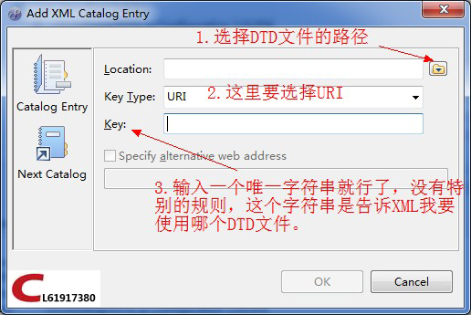

# 自定义DTD（myeclipser的XML提示功能）

`原创` `2013-08-24 12:48:02`

了解DTD定义详见：http://www.w3school.com.cn/dtd/dtd_elements.asp

PS:文本只是简单的介绍，启到抛砖引玉的作用。

**1.创建DTD文件**

```xml
<?xml version="1.0" encoding="UTF-8"?>
<!ELEMENT js (content)>
<!ELEMENT content (num,type,mode,assist,annotation)>
<!ATTLIST num
	value CDATA "1"
>
<!ATTLIST type
	value (js|jq) "js"
>
<!ATTLIST mode
	value (static|method) "static"
>
```

**2.在myeclipse中添加DTD引用（window-->Preferences-->XML-->XML Catalog）**





**3.在myeclipse中打开XML文件，右键文件选择Open With --> MyEclipse XML Editor**


完成以上三步就可以实现XML自定义提示了^_^ 
