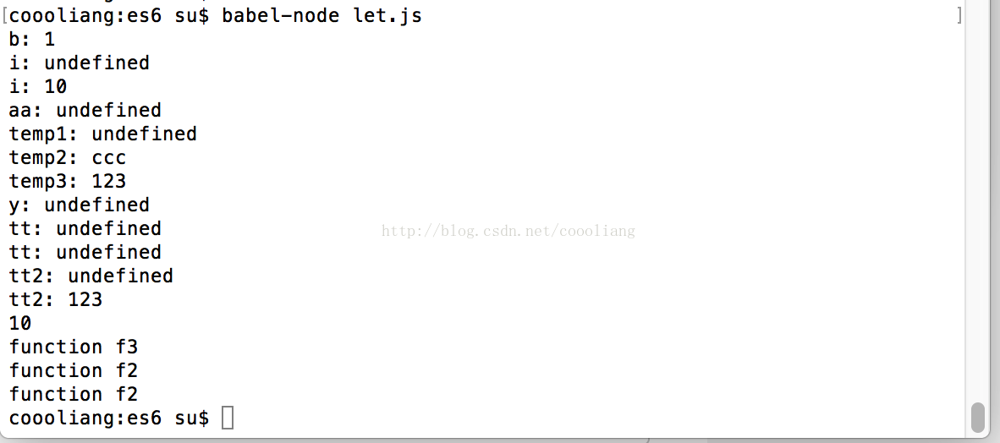

# let的使用

`转载` `2017-10-16 16:41:33`

```js
//2.1.1基本用法
{
	let a = 10;
	var b = 1;
}

//console.log(a);//报错，a is not defined
console.log("b: " + b);

for(let i = 0;i<10; i++){

}
console.log("i: " + i);//undefined

for(var i = 0;i<10; i++){

}
console.log("i: " + i);//10


//2.1.2 不存在变量提升
console.log("aa: " + aa);//undefined
var aa = 2;//之后才定义

//console.log(bb);//报错, bb is not defined
let bb = 2;//之后才定义


//2.1.3暂性死区,如果区块中存在let和const命令，则这个区块对命令声明的变量从一开始就形成封闭作用域。声明之前使用这个变量，就会报错。
var temp = 123;
if(true){
	//temp = 'abc';//报错，temp is not defined
	//console.log(temp);

	let temp;
	console.log("temp1: " + temp);//undefined

	temp = 'ccc';
	console.log("temp2: " + temp);//ccc
}
console.log("temp3: " + temp);//123

typeof x;
//let x;//报错，x is not defined

var y = y;
console.log("y: " + y);//undefined

//let z = z;//报错， z is not defined
//总之记住let一定要在声明后才可以使用


//2.1.4不能重复声明
{
	let a1 = 10;
	//var a1 = 1;//报错，Identifier 'a1' has already been declared
}
{
	let a = 10;
	//let a = 1;//报错,Duplicate declaration a
}

function fa(arg){
	//let arg;//报错,Duplicate declaration "arg"
}

function fa(arg){
	var arg;
}

//2.2.1为什么需要块级作用域
//1.内层变量可能覆盖外层变量
var tt = new Date();
function fa(){
	console.log("tt: " + tt);//undefined
	if (false) {
		var tt = '123';
	}
	console.log("tt: " + tt);//undefined
}
fa();

var tt2 = new Date();
function fa2(){
	console.log("tt2: " + tt2);//undefined
	if (true) {
		var tt2 = '123';
	}
	console.log("tt2: " + tt2);//123
}
fa2();

//2.用于计数的循环变量泄露为全局变量
for(var index = 0;index<10;index++){
}
console.log(index);//10


//2.2.2ES6的块作用域,且可以重复嵌套
{let insane = 'hello world'}
{{{let insane = 'hello world'}}}
let insane = 'hello'


//2.2.3在块中声明函数
try{
	function f(){
		console.log("function f3");//function f3
	}
	f();
}catch(e){

}
if(true){
	function f(){
		console.log("function f1");//function f2,会被后面的函数覆盖
	}
	f();

	function f(){
		console.log("function f2");//function f2
	}
	f();
}


function ff(){console.log("I am outside")}
(function(){
	if (false) {
		function ff(){
			console.log("I am outside")
		}
	}
	//ff();//ff is not a function
}())

if (true) {
	function tf(){}
}

//if (true) function tf2(){};//if没有带括号，也会报错。

//由于考虑兼容问题，ES6处理块中的函数不会像let一样。
//1）允许在块级作用域内声明函数；
//2）函数声明类似var，即会提升到全局作用域或函数作用域的头部；
//3）同时，函数声明还会提升到所在的块级作用域的头部。
```

运行结果：



整理内容摘自《ES6标准入门》第三版  阮一峰
