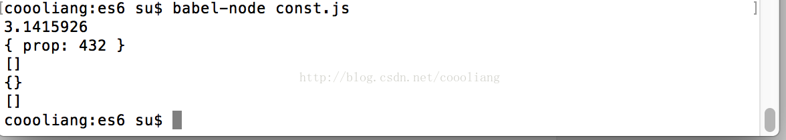

# const的使用

`转载` `2017-10-16 16:50:50`

```js
//2.3.1const用于声明一个常量，不量声明，常量的值不能改变。
const PI = 3.1415926;//声明的同时就必须给予赋值
//PI = 0;//报错，TypeError: Assignment to constant variable.
console.log(PI);

//作用域与let相同
{
	const a = "123";
}
//console.log(a);//报错,ReferenceError: a is not defined

var message = "Hello";
let age = 15;

//以下两行都会报错 
//const message = "world";//报错,SyntaxError: Identifier 'message' has already been declared
//const age = 10;//报错,Duplicate declaration "age


//2.3.2本质
//const实际上保证的并不是变量的值不得改动，而是变量指向的那个内存地址不得改动。
const foo = {}
foo.prop = 123;
foo.prop = 432;
console.log(foo);//{ prop: 432 }

const arr = [];
arr.push("hello");//可执行
arr.length = 0;//可执行
//arr = ["adf"];//报错，TypeError: Assignment to constant variable.
console.log(arr);

const foo2 = Object.freeze({})//将对象冻结
foo2.prop = 123;
console.log(foo2);//{}

const arr2 = Object.freeze([]);
//arr2.push("hello");//报错，TypeError: Can't add property 0, object is not extensible
console.log(arr2);//[]

//将对象彻底冻结函数
var constantize = (obj) => {
	Object.freeze(obj);
	Object.keys(obj).forEach((key,i) => {
		if (typeof obj[key] === 'object') {
			constantize(obj[key]);
		}
	});
};
```

运行结果：



整理内容摘自《ES6标准入门》第三版  阮一峰 
