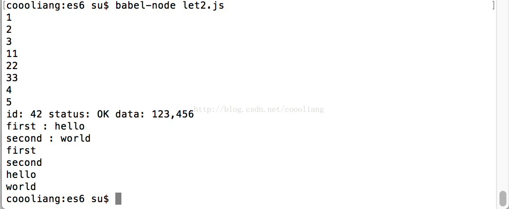

# 变量的解析赋值

`转载` `2017-10-17 14:32:46`

```js
//ES6声明变量的6种方式
//ES5有两种：var和function
//ES6除了这两个还有let,const,import,class

//------------- 变量的解析赋值用途 -------------
//let a = 1;
//let b = 2;
//let c = 3;
let [a,b,c] = [1,2,3];
console.log(a);
console.log(b);
console.log(c);

//从函数返回多个值
function example(){
	return [11,22,33];
}
let [aa,bb,cc] = example();
console.log(aa);
console.log(bb);
console.log(cc);

function example2(){
	return {
		foo:4,
		bar:5
	};
}
let {foo,bar} = example2();
console.log(foo);
console.log(bar);

//参数的定义
function f([x,y,z]){}
f([1,2,3]);//有序

function f2({x,y,z}){}
f2({z:3,y:2,x:1});//无序

//提取JSON
let jsonData = {
	id:42,
	status:"OK",
	data:[123,456]
}
let {id,status,data:num} = jsonData;
console.log("id: " + id + " status: " + status + " data: " + num);

//函数参数默认值
//jQuery.ajax = function(url,{async=true,cache=true}){}

//遍历map
var map = new Map();
map.set("first","hello");
map.set("second","world");
for(let [key,value] of map){
	console.log(key + " : " + value);
}
for(let [key] of map){
	console.log(key);//只获得key
}
for(let [,value] of map){
	console.log(value);//只获得value
}

//输入模块的指定方法
const { SourceMapConsumer,SourceNode } = require("source-map");
```

node和浏览器获得window对象

```js
var getGlobal = function(){
	if(typeof self !== 'undefined'){console.log('self');return self;}
	if(typeof window !== 'undefined'){console.log('window');return window;}
	if(typeof global !== 'undefined'){console.log('global');return global;}
	throw new Error('unable to locate global object');
}
```

```js
if (window) {
	console.log('window');
}else{
	var window = getGlobal();
}
```

运行结果：



 整理内容摘自《ES6标准入门》第三版  阮一峰
