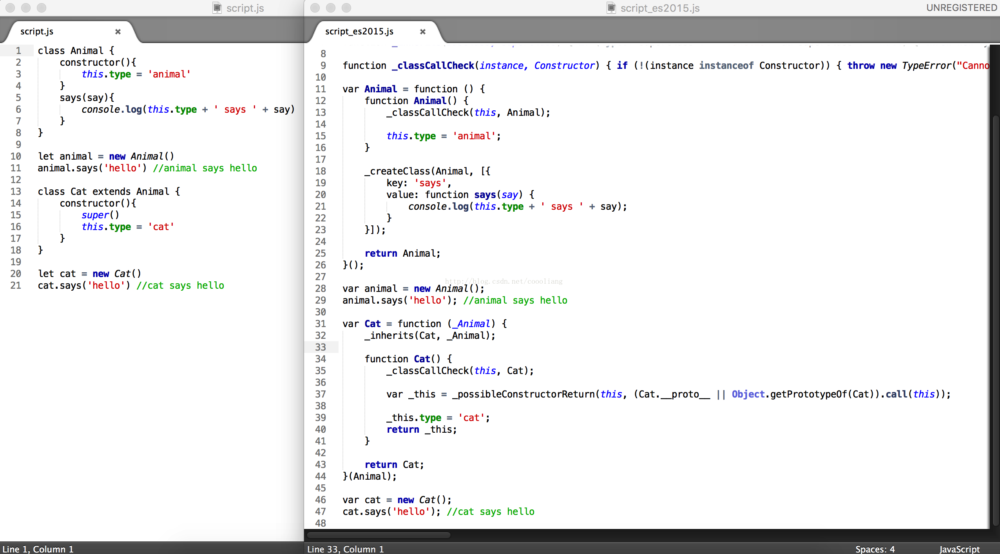

# Babel之HelloWorld

`转载` `2017-10-13 16:27:28`

ES6语法可以让开发人员使用**面向对象**的方式写代码，但是不是所有浏览器都支持ES6语法。所以需要将ES6语法的js文件转换成大部分浏览器都可以运行的ES5语法。

这时候就要用到Babel

对应的网站是: https://babeljs.io/     中文: http://babeljs.cn/

1.安装nodejs

2.安装npm

3.安装babel（我是macOS系统，sudo表示添加权限）

```bash
#打开命令行
#Babel提供babel-cli工具，用于命令行转码。它的安装命令如下
sudo npm install --global babel-cli

#ES2015转码规则
sudo npm install --save-dev babel-preset-es2015

#react转码规则
sudo npm install --save-dev babel-preset-react

# ES7不同阶段语法提案的转码规则（共有4个阶段），选装一个
sudo npm install --save-dev babel-preset-stage-2
```

windows:

```bash
#1.设置taobao服务，因为npm被墙
npm config set registry https://registry.npm.taobao.org

#2.配置后可通过下面方式来验证是否成功 
npm config get registry

#3.通过cnpm使用
npm install -g cnpm --registry=https://registry.npm.taobao.org
#使用 
cnpm install express

#4.安装babel
npm install --global babel-cli
npm install --save-dev babel-preset-es2015  
npm install --save-dev babel-preset-react
npm install --save-dev babel-preset-stage-2
```


4.创建一个ES6语法的JS文件(可以用class和extends是不是很爽)

script.js:

```typescript
class Animal {
    constructor(){
        this.type = 'animal'
    }
    says(say){
        console.log(this.type + ' says ' + say)
    }
}

let animal = new Animal()
animal.says('hello') //animal says hello

class Cat extends Animal {
    constructor(){
        super()
        this.type = 'cat'
    }
}

let cat = new Cat()
cat.says('hello') //cat says hello
```

5.使用命令行生成新的文件： 

```bash
babel script.js --presets es2015 -o script_es2015.js
或者
babel script.js --presets es2015,react,stage-2 -o script_es2015.js

查看结果：
node script_es2015.js
```

效果图：


 
记录内容来自《ES6标准入门》第三版  阮一峰 

部分内容来自网络
