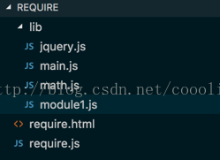

# RequireJS模块化之HelloWorld

`原创` `2017-12-29 11:25:18`

部分代码转载自http://www.ruanyifeng.com/blog/2012/11/require_js.html

RequireJS: http://requirejs.org/

demo.html

```html
<!doctype html>
<html>
    <head>
        <meta http-equiv=“Content-Type” content="text/html" charset="utf-8">
                <title>标题</title>
    </head>
    <body>
        <div>
            <h1>Require Demo 1 -- usage of Require()</h1>
            <button id="contentBtn">Click me</button>
             <p id="messagebox"></p>
        </div>
    </body>
</html>

<script src="require.js" defer async="true" data-main="lib/main"></script>
```

main.js 

```js
require.config({
    paths: {
        'jquery': 'jquery',
        'md': 'module1'
    }
});

//  js/script/main.js
//调用math模块的add方法
require(['math'], function (math) {
    console.log('math.add(1,1) = ' + math.add(1, 1));
    math.hello();
});


require(['jquery', 'md'], function ($, module) {
    $(document).on('click', '#contentBtn', function () {
        $('#messagebox').html('You have access Jquery by using require()');
    });
});

require(['md'], function (module) {
    console.log(module.module);
});
```

math.js

```js
//在math模块中，定义一个add方法
define(['md'],function (md) {
    var add = function (x, y) {
        return x + y;
    };
    var hello = function(){
        console.log('math say: ' + md.hello);
    };
    return {
        add: add,
        hello:hello
    };
});
```

module1.js 

```js
define(function(){
    return{
        module : 'this is module1',
        hello : 'hello world'
    };
})
```

目录结构：



输出结果：


