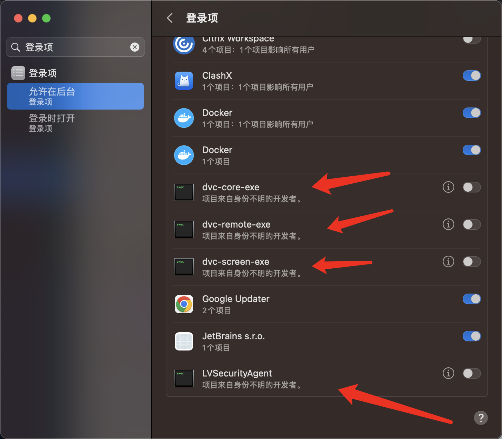
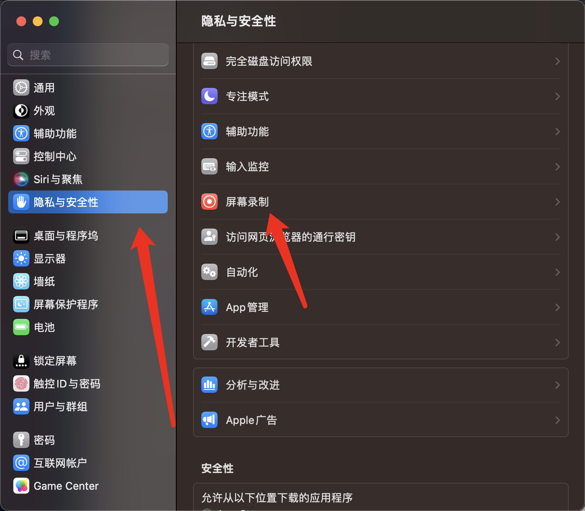
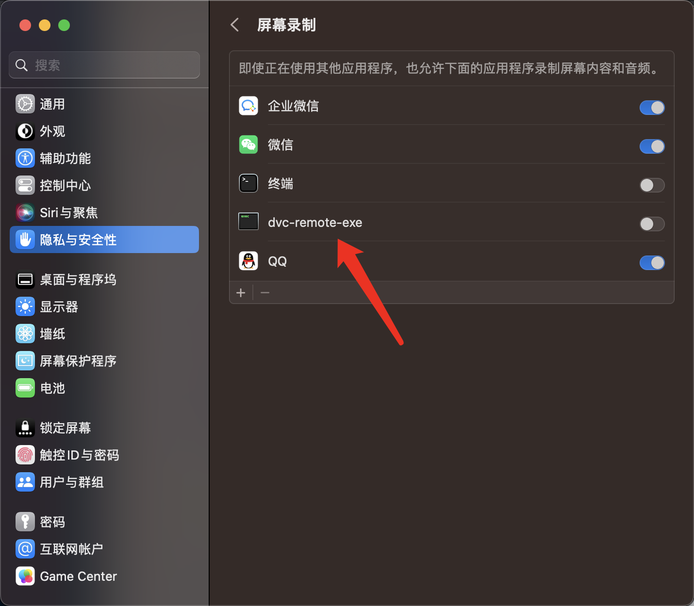
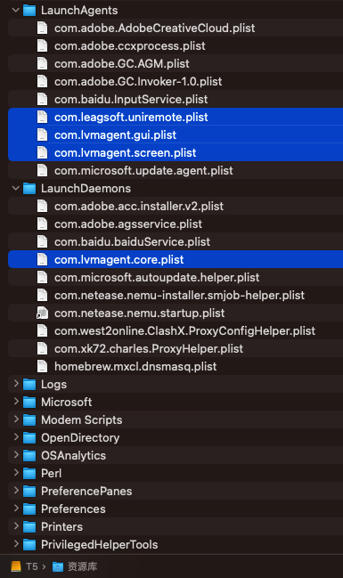
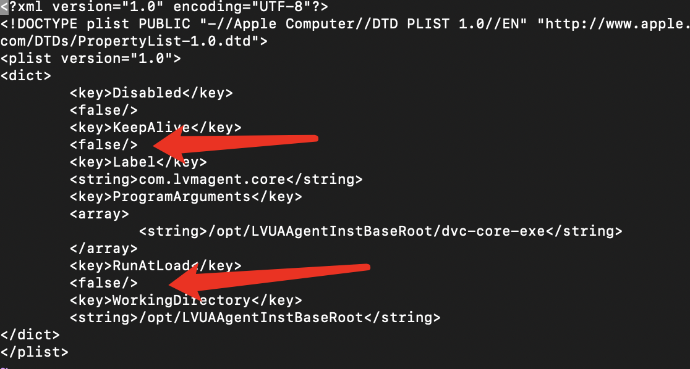

# Mac系统LVSecurityAgent卸载方法

`转载` `2023-07-20 18:42:11`

https://blog.static.run/archives/remove-lvsecurityagent-tutorial

1. 第一步: 关掉软件自启动
通用 --> 登录项 
关闭dvc-core-exe,dvc-remote-exe,dvc-screen-exe,LVSecurityAgent



2. 关闭屏幕录像




3. 使用Sublime修改以下文件，因为Sublime会自动复制一份再覆盖文件，可以直接修改并保存成功

```
/Library/LaunchAgents/com.leagsoft.uniremote.plist
/Library/LaunchAgents/com.lvmagent.gui.plist
/Library/LaunchAgents/com.lvmagent.screen.plist

/Library/LaunchDaemons/com.lvmagent.core.plist
```



将KeepAlive和RunAtLoad都修改为false



> 第二步: 重启电脑
这时候的LVSecurityAgent监控进程和核心功能都已经关闭


> 第三步: 手动启动核心程序
用下面指令可以手动执行
sudo /opt/LVUAAgentInstBaseRoot/dvc-core-exe &
你会发现活动监视器里面只有两个dvc-xxx-xxx进程，如果想使用他的WIFI认证功能就让他在后台跑者，不想让他跑者就用活动监视器里面关停

### 如何删除?
我们万能的sudo大法，尝试执行以下命令

```
sudo rm -rf /opt/LVUAAgentInstBaseRoot/
sudo rm -rf /Applications/LVSecurityAgent.app/
sudo rm -rf /Library/LaunchAgents/com.lvmagent.gui.plist
sudo rm -rf /Library/LaunchAgents/com.lvmagent.gui.plist
sudo rm -rf /Library/LaunchAgents/com.leagsoft.uniremote.plist
sudo rm -rf /Library/LaunchDaemons/com.lvmagent.core.plist
```