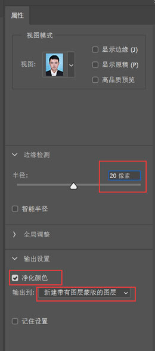
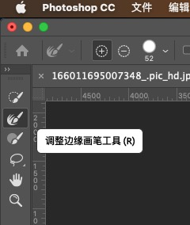

# ps更换照片背景--头发边缘处理

`转载` `2023-09-18 14:22:11`
 
[证件照换背景——头发边缘处理](http://www.lgwimonday.cn/archives/797)

1. 添加照片到ps软件中

2. 按住ctrl+j复制图层

3. 选择"魔棒"工具，选中“图层1”，点击蓝色背景部分.

4. 鼠标移动至选区上，右击，选择“选择反向”

5. 在选中“魔棒”工具的前提下，点击工具条的“选择并遮住”

6. 选择调整边缘画笔，去除头发中的背景颜色
  

7. 按照如下参数进行设置，如果边缘效果不理想，背景杂色太多，则将边缘检测的半径设置大一些。

