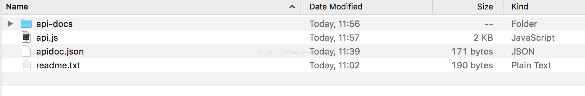
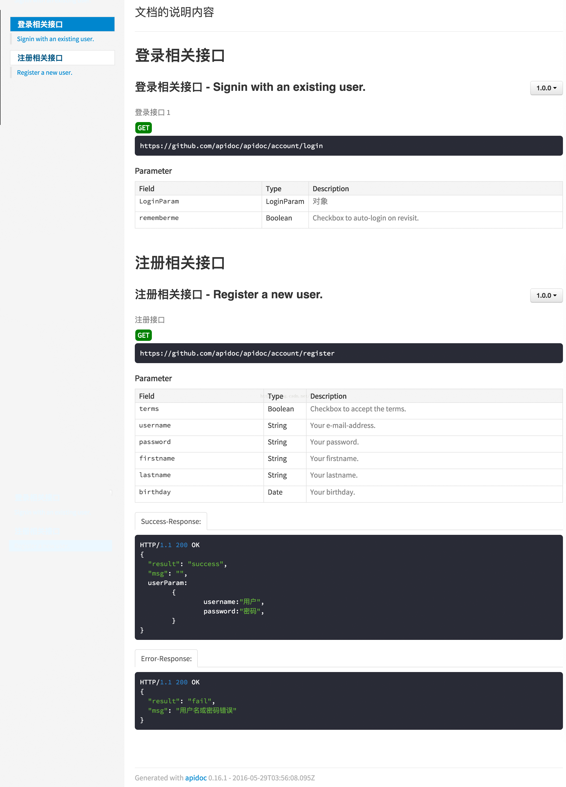

# 【推荐】apidoc api文档生成工具的使用(mac)

`原创` `2016-05-29 12:18:25`

apidoc是通过js和json文件生成本地的html api文档，个人感觉相当好用；

github地址：https://github.com/apidoc/apidoc

1.安装 apidoc，如果不行安装一下nodejs npm install apidoc -g

或者使用

sudo npm install apidoc -g2.cd 到当前目录，然后执行以下命令，会在本目录中创建api-docs的文件夹apidoc -i . -o api-docs

需要创建两个文件，然后再在终端运行步骤2的命令：

文件1，apidoc.json:

```java
{
  "title": "文档的标题",
  "name": "文档的名称",
  "version": "1.0.0",
  "description": "文档的说明内容",
  "url" : "https://github.com/apidoc/apidoc"
}
```

文件2，api.js: 

```java
//-------------------------------------------------- api beans -----------------------------------------------//
/**
 * @apiDefine LoginParam
 * @apiParam {String} username Your e-mail-address.
 * @apiParam {String} password Your password.
 */

/**
 * @apiDefine UserParam
 * @apiParam {String} firstname Your firstname.
 * @apiParam {String} lastname  Your lastname.
 * @apiParam {Date}   birthday  Your birthday.
 */


//-------------------------------------------------- api urls -----------------------------------------------//

//----------------------- register ----------------------- //
/**
 * @apiDefine RegisterGroup
 *
 * 注册相关接口
 */

/**
 * @api {GET} /account/register Register a new user.
 *	
 * @apiGroup RegisterGroup
 * @apiName Register
 * @apiDescription 注册接口
 * @apiVersion 1.0.0
 * 
 * @apiUse LoginParam
 * @apiUse UserParam
 * @apiParam {Boolean} terms Checkbox to accept the terms.
 *
 * @apiSuccessExample Success-Response:
 *     HTTP/1.1 200 OK
 *     {
 *       "result": "success",
 *       "msg": "",
 *       userParam:
 *       	{
 *       		username:"用户",
 *       		password:"密码",
 *       	}
 *     }
 *
 * @apiErrorExample Error-Response:
 *     HTTP/1.1 200 OK
 *     {
 *       "result": "fail",
 *       "msg": "用户名或密码错误"
 *     }
 */

//----------------------- login ----------------------- //
/**
 * @apiDefine LoginGroup
 *
 * 登录相关接口
 */

//------ login1.1.0版本 ------ //
 /**
 * @api {GET} /account/login Signin with an existing user.
 *
 * @apiGroup LoginGroup
 * @apiName login
 * @apiDescription 登录接口 2
 * @apiVersion 1.1.0
 *
 * @apiParam {LoginParam} LoginParam对象
 * @apiParam {Boolean} rememberme Checkbox to auto-login on revisit.
 */

//------ login1.0.0版本 ------ //
/**
 * @api {GET} /account/login Signin with an existing user.
 *
 * @apiGroup LoginGroup
 * @apiName login
 * @apiDescription 登录接口 1
 * @apiVersion 1.0.0
 *
 * @apiParam {LoginParam} LoginParam对象
 * @apiParam {Boolean} rememberme Checkbox to auto-login on revisit.
 */


```

生成的效果图：




