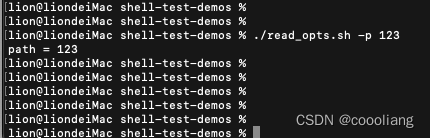

# 自定义传入参数

`原创` `2023-06-30 11:02:05`

授权

```shell
cd /Users/lion/Downloads/shell-test-demos
chmod u+x *.sh
```

```shell
#!/bin/bash

printHelp() {
    echo "-p pic (required) path for pic"
    exit 1
}

while getopts 'p:h' OPT; do
    case $OPT in
    p) path="$OPTARG" ;;
    esac
done

# check api_key exists
if [ -z "$path" ]; then
    echo "path is empty"
    printHelp
fi

echo "path = $path"
 
```


