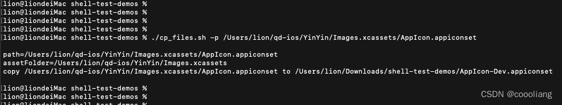

# 复制用户传参的文件夹

`原创` `2023-06-30 11:08:11`

授权

```shell
cd /Users/lion/Downloads/shell-test-demos
chmod u+x *.sh
```

```shell
#!/bin/bash

printHelp() {
    echo "-p pic (required) path for pic"
    exit 1
}

while getopts 'p:h' OPT; do
    case $OPT in
    p) path="$OPTARG" ;;
    esac
done

# check api_key exists
if [ -z "$path" ]; then
    echo "path is empty"
    printHelp
fi

echo ""
echo "path=$path"

assetFolder=`echo $(dirname $path)`
echo "assetFolder=$assetFolder"

copyFileName="AppIcon-Dev.appiconset"
debugAppIconPath="`pwd`/$copyFileName"

echo "copy $path to $debugAppIconPath"

rm -rf "./$copyFileName"
cp -rf $path $debugAppIconPath
open ./

echo ""

```



