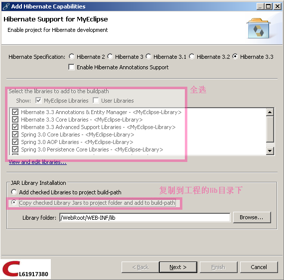
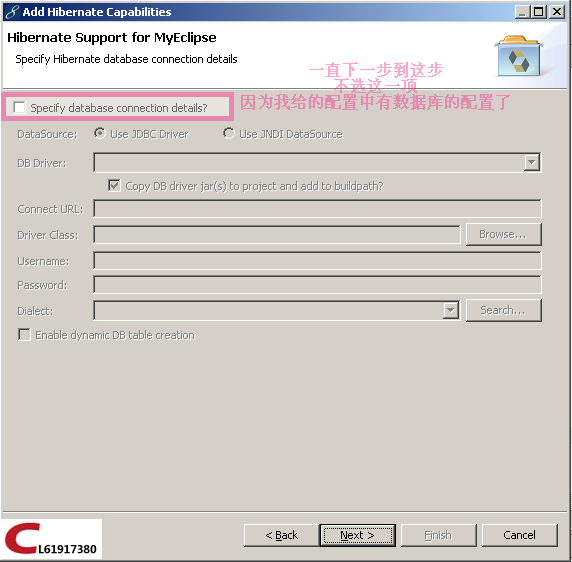
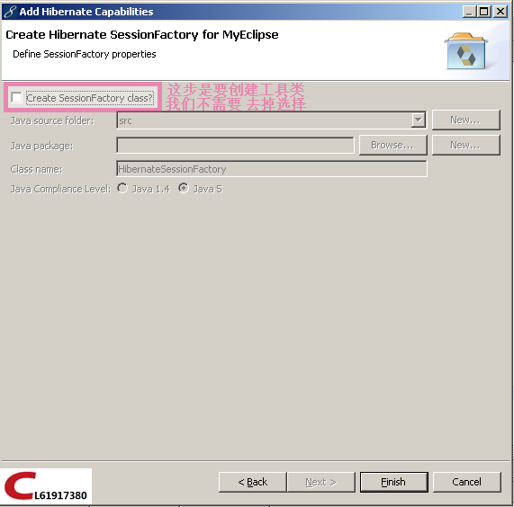

# SSH整合（Struts2.2.1 + Spring3.0 + Hibernate3.3）

`原创` `2011-03-21 17:57:00`

转载请注明出处：http://blog.csdn.net/cl61917380/article/details/6265620

培训终于到了最后一个阶段了！

使用工具MyEclipse8.6

今天初探Hibernate老师提前说了SSH的整合，鸡动人心!

过程：

```xml
版本:struts2.2.1 + spring3.0 + hibernate3.3 MyEclipse8.6引入JAR包 
1.引入JAR包： 
a)可以使用myeclipse自带的功能引入所需要的包: 右键工程-->MyEclipse--> add Hibernate capabilities,add spring capabilities 
b)struts2的包可以从 下载的目录下复制有 七 个包 例如：E:/CL/API/struts-2.2.1.1-all/struts-2.2.1.1/apps/struts2-blank/WEB-INF/lib 
c)还需要插件包 struts2-spring-plugin-2.2.1.1.jar 例如：E:/CL/API/struts-2.2.1.1-all/struts-2.2.1.1/lib 

2.配置文件:（主要是web.xml和applicationContext.xml的配置） 
web.xml: 
<filter> 
    <filter-name>struts2</filter-name> 
<filter-class>org.apache.struts2.dispatcher.ng.filter.StrutsPrepareAndExecuteFilter</filter-class> 
</filter> 
<filter-mapping> 
    <filter-name>struts2</filter-name> 
    <url-pattern>/*</url-pattern> 
</filter-mapping> 
<context-param> 
    <param-name>contextConfigLocation</param-name> 
    <param-value>classpath:applicationContext.xml</param-value> 
</context-param> 
<listener> 
    <listener-class>org.springframework.web.context.ContextLoaderListener</listener-class> 
</listener> 

applicationContext.xml: 
<beans xmlns="http://www.springframework.org/schema/beans" xmlns:xsi="http://www.w3.org/2001/XMLSchema-instance" xmlns:context="http://www.springframework.org/schema/context" xmlns:tx="http://www.springframework.org/schema/tx" xmlns:aop="http://www.springframework.org/schema/aop" xsi:schemaLocation="http://www.springframework.org/schema/beans http://www.springframework.org/schema/beans/spring-beans-3.0.xsd http://www.springframework.org/schema/tx http://www.springframework.org/schema/tx/spring-tx-3.0.xsd http://www.springframework.org/schema/context http://www.springframework.org/schema/context/spring-context-3.0.xsd http://www.springframework.org/schema/aop http://www.springframework.org/schema/aop/spring-aop-3.0.xsd"> 
    <!-- 支持元注释 -->
    <context:annotation-config /> 

    <!-- 扫描包目录 --> 
    <context:component-scan base-package="com">

    </context:component-scan> 
        <bean id="sessionFactory" class="org.springframework.orm.hibernate3.LocalSessionFactoryBean"> 
            <property name="configLocation" value="classpath:hibernate.cfg.xml"></property>
        </bean>
        <bean id="hibernateTemplate" class="org.springframework.orm.hibernate3.HibernateTemplate">
            <property name="sessionFactory"><ref bean="sessionFactory" /></property> 
        </bean>
</beans> 

hibernate.cfg.xml: 
<!DOCTYPE hibernate-configuration PUBLIC "-//Hibernate/Hibernate Configuration DTD 3.0//EN" "http://hibernate.sourceforge.net/hibernate-configuration-3.0.dtd"> 
<hibernate-configuration> 
<session-factory> 
    <property name="dialect"> org.hibernate.dialect.Oracle9Dialect</property> 
    <property name="connection.url">jdbc:oracle:thin:@localhost:1521:oracle</property> 
    <property name="connection.username">chenl</property> 
    <property name="connection.password">chenl</property> 
    <property name="connection.driver_class">oracle.jdbc.driver.OracleDriver</property> 
<!-- 
    <mapping resource="com/po/TUser.hbm.xml" />
    <mapping resource="com/po/TDetail.hbm.xml" /> 
--> 
</session-factory> 
</hibernate-configuration> 

struts.xml: 
<!DOCTYPE struts PUBLIC "-//Apache Software Foundation//DTD Struts Configuration 2.0//EN" "http://struts.apache.org/dtds/struts-2.0.dtd"> 
<struts> 
    <constant name="struts.enable.DynamicMethodInvocation" value="false" /> 
    <constant name="struts.devMode" value="true" /> 
    <package name="user" extends="struts-default" namespace="/user"> 
        <action name="user" class="com.coooliang.action.UserAction"> </action> 
    </package> 
</struts>
```

图片步骤:

引入spring的包


引入hibernate的包：



一直下一步。。。





结束. PS:

```java
使用hibernateTemplate： 

Action中代码： 

@Component("userAction") 
@Scope("prototype") 
public class UserAction { 
    @Resource 
    private HibernateTemplate hibernateTemplate; 
    public void execute() {
       TUser user = new TUser(); 
       user.setUsername("aaa"); 
       TDetail tdetail = new TDetail(); 
       tdetail.setIdcard("11111111111"); 
       tdetail.setEmail("aa@qq.com");
       tdetail.setTuser(user); 
       user.setTdetail(tdetail); 
       hibernateTemplate.save(user); 
       hibernateTemplate.flush(); 
    } 
}
```

注意： 由于是比较新的版本 所以 整合后需要用到asm3.3版本的jar包而不是asm.jar

下载地址 自己百度（asm3.3.jar）

我把JAR包上传到CSDN了：[strutsSpringHibernateJar-Java其他资源-CSDN下载](http://download.csdn.net/detail/cl61917380/5290305)

是需要1分的下载积分的^_^
