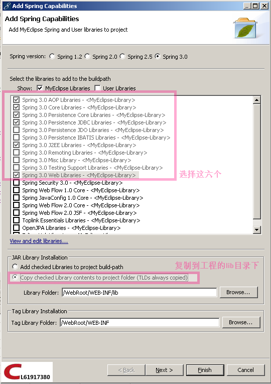

# SSI整合以及缓存的配置（Struts2.2.1.1 + Spring3.0.1 + iBatis2.3.0.677）

`原创` `2011-06-06 21:50:00`

我使用的是myEclipse8.6版本

1.首先导入struts2的jar包和插件包（在下载的struts-2.2.1.1-all/struts-2.2.1.1/apps/struts2-blank/WEB-INF/lib下所有jar包 和struts-2.2.1.1-all/struts-2.2.1.1/lib/struts2-spring-plugin-2.2.1.1.jar）

2.使用myEclipse8.6自带的功能引入spring3.0的jar包





3.加入ehcache-1.6.0.jar，ibatis-2.3.0.677.jar，（网上自己下载）

ojdbc14.jar，org.springframework.context.support-3.0.0.RELEASE.jar 


接下来是配置文件：

> web.xml

```xml
<!-- 读取spring配置文件 -->  
<context-param>
  <param-name>contextConfigLocation</param-name>
  <param-value> classpath:applicationContext.xml classpath:cacheContext.xml </param-value>
</context-param>
<listener>
  <listener-class>org.springframework.web.context.ContextLoaderListener</listener-class>
</listener>

<!-- struts 过滤器 -->
<filter>
  <filter-name>struts2</filter-name>
  <filter-class>org.apache.struts2.dispatcher.ng.filter.StrutsPrepareAndExecuteFilter</filter-class>
</filter>
<filter-mapping>
  <filter-name>struts2</filter-name>
  <url-pattern>/*</url-pattern>
</filter-mapping> 
```

> struts.xml

**因为有struts2-spring-plugin-2.2.1.1.jar** 

**所有我可以写Action的全路径（com.coooliang.action.UserAction）而不用在applicationContext.xml中配置Action**

```xml
<struts>
  <constant name="struts.devMode" value="true" />
  <package name="user" extends="struts-default" namespace="/user">
    <action name="user" class="com.coooliang.action.UserAction">
      <result>/index.jsp</result>
    </action>
  </package>
</struts> 
 ```

> applicationContext.xml

```xml
<?xml version="1.0" encoding="UTF-8"?>
<beans
  xmlns="[http://www.springframework.org/schema/beans](http://www.springframework.org/schema/beans)"
  xmlns:xsi="[http://www.w3.org/2001/XMLSchema-instance](http://www.w3.org/2001/XMLSchema-instance)"
  xmlns:aop="[http://www.springframework.org/schema/aop](http://www.springframework.org/schema/aop)"
  xmlns:context="[http://www.springframework.org/schema/context](http://www.springframework.org/schema/context)"
  xmlns:tx="[http://www.springframework.org/schema/tx](http://www.springframework.org/schema/tx)"
  xsi:schemaLocation="[http://www.springframework.org/schema/beans](http://www.springframework.org/schema/beans)[http://www.springframework.org/schema/beans/spring-beans-2.5.xsd](http://www.springframework.org/schema/beans/spring-beans-2.5.xsd)        [http://www.springframework.org/schema/tx](http://www.springframework.org/schema/tx)     [http://www.springframework.org/schema/tx/spring-tx-2.5.xsd](http://www.springframework.org/schema/tx/spring-tx-2.5.xsd)        [http://www.springframework.org/schema/aop](http://www.springframework.org/schema/aop)     [http://www.springframework.org/schema/aop/spring-aop-2.5.xsd](http://www.springframework.org/schema/aop/spring-aop-2.5.xsd)     [http://www.springframework.org/schema/context](http://www.springframework.org/schema/context)     [ http://www.springframework.org/schema/context/spring-context-2.5.xsd](http://www.springframework.org/schema/context/spring-context-2.5.xsd)">

<!--   配置文件读取 需 要加入applicationContext.properties文件 -->
<bean id="propertyConfigurer" class="org.springframework.beans.factory.config.PropertyPlaceholderConfigurer">
  <property name="locations">
    <list>
      <value>classpath:applicationContext.properties</value>
    </list>
  </property>
</bean>

  <!-- 支持元注释 -->  <context:annotation-config />

 <!-- 扫描包目录 -->  <context:component-scan base-package="com"></context:component-scan>

 <!-- 数据源 -->  
<bean id="dataSource" class="org.apache.commons.dbcp.BasicDataSource" destroy-method="close">
  <property name="driverClassName" value="oracle.jdbc.driver.OracleDriver" />
  <property name="url" value="jdbc:oracle:thin:@localhost:1521:oracle" />
  <property name="username" value="chenl" />
  <property name="password" value="chenl" />
</bean>  <!-- 大字段 -->
<bean id="lobHandler" class="org.springframework.jdbc.support.lob.DefaultLobHandler" />

 <!-- ibatis 必须  因为需要读取配置文件 classpath:sqlmap-config.xml -->  
 <bean id="sqlMapClient" class="org.springframework.orm.ibatis.SqlMapClientFactoryBean">
  <property name="configLocation" value="classpath:sqlmap-config.xml" />
  <property name="dataSource" ref="dataSource" />
  <property name="lobHandler" ref="lobHandler"></property>
</bean>

 <!-- 1.第一种方式(必须使用注解的方式@Resource) ： 自定义一些方法 如queryForString,queryForBoolean等 -->  
 <bean id="mySqlMapClientDaoSupport" class="com.coooliang.dao.common.MySqlMapClientDaoSupport">
  <property name="dataSource" ref="dataSource" />
  <property name="sqlMapClient" ref="sqlMapClient" />
</bean>
<!-- 2.第二种方式(必须使用注解的方式@Resource)，使用get,set方式需要使用接口的方式才行-->  
<bean id="sqlMapClientTemplate" class="org.springframework.orm.ibatis.SqlMapClientTemplate">
  <property name="dataSource" ref="dataSource" />
  <property name="sqlMapClient" ref="sqlMapClient" />
</bean>
</beans>
```

> ibatis的配置文件（sqlmap-config.xml）

```xml
<?xml version="1.0" encoding="UTF-8"?>
<!DOCTYPE sqlMapConfig PUBLIC "-//ibatis.apache.org//DTD SQL Map Config 2.0//EN" "[http://ibatis.apache.org/dtd/sql-map-config-2.dtd](http://ibatis.apache.org/dtd/sql-map-config-2.dtd)">

<!-- ibatis配置文件  --> 
<sqlMapConfig>
  <settings cacheModelsEnabled="true" enhancementEnabled="true" lazyLoadingEnabled="true" errorTracingEnabled="true"
    maxRequests="512" maxSessions="128" maxTransactions="32" useStatementNamespaces="true" /> <!-- 引入xml文件 -->
  <sqlMap resource="com/coooliang/dao/config/common.ibatis.xml" />
</sqlMapConfig>
```

> common.ibatis.xml

```xml
<?xml version="1.0" encoding="UTF-8" ?>
<!DOCTYPE sqlMap
  PUBLIC "-//ibatis.apache.org//DTD SQL Map 2.0//EN" "[http://ibatis.apache.org/dtd/sql-map-2.dtd](http://ibatis.apache.org/dtd/sql-map-2.dtd)">


 <!-- 例子 --> 
 <sqlMap namespace="common">
  <typeAlias alias="user" type="com.coooliang.dao.entity.User" />

  <resultMap id="resultUser" class="com.coooliang.dao.entity.User">
    <result column="NID" property="nid" />
    <result column="PASSWORD" property="password" />
    <result column="USERNAME" property="username" />
  </resultMap>

  <!-- 查询一个User-->  
  <select id="getSingleUser" parameterClass="string" resultMap="resultUser">   
    <!--[CDATA[    select nid,username,password    from t_user    where nid = #nid#    ORDER BY nid   ]]>
  </select>

  <!-- 查询出列表  -->  
  <select id="getUserList" resultMap="resultUser">
  <![CDATA[    select nid,username,password    from t_user    ORDER BY nid   ]]--> 
  </select> 
</sqlMap> 
 ```

**因为web.xml中有加入classpath:cacheContext.xml 这是缓存的文件**

**所以必须在src下加入cacheContext.xml和ehcache-application.xml两个文件**

**ehcache-application.xml:(这个文件中最好不要加中文和注释否则可能会有问题)**

```xml
<?xml version="1.0" encoding="UTF-8"?>
<ehcache xmlns:xsi="[http://www.w3.org/2001/XMLSchema-instance](http://www.w3.org/2001/XMLSchema-instance)"
  xsi:noNamespaceSchemaLocation="[http://ehcache.org/ehcache.xsd](http://ehcache.org/ehcache.xsd)">
  <diskStore path="java.io.tmpdir" />
  <cacheManagerEventListenerFactory class="" properties="" />
  <defaultCache maxElementsInMemory="10000" eternal="false" timeToIdleSeconds="120" timeToLiveSeconds="120"
    overflowToDisk="true" diskSpoolBufferSizeMB="30" maxElementsOnDisk="10000000" diskPersistent="false"
    diskExpiryThreadIntervalSeconds="120" memoryStoreEvictionPolicy="LRU" />
  <cache name="coreCache" maxElementsInMemory="3" eternal="true" overflowToDisk="false" />
</ehcache>
```

> cacheContext.xml
 
```xml
<?xml version="1.0" encoding="UTF-8"?>
<beans
  xmlns="[http://www.springframework.org/schema/beans](http://www.springframework.org/schema/beans)"
  xmlns:xsi="[http://www.w3.org/2001/XMLSchema-instance](http://www.w3.org/2001/XMLSchema-instance)"
  xmlns:jee="[http://www.springframework.org/schema/jee](http://www.springframework.org/schema/jee)"
  xmlns:tx="[http://www.springframework.org/schema/tx](http://www.springframework.org/schema/tx)"
  xmlns:context="[http://www.springframework.org/schema/context](http://www.springframework.org/schema/context)"
  xsi:schemaLocation="[http://www.springframework.org/schema/beans](http://www.springframework.org/schema/beans)[http://www.springframework.org/schema/beans/spring-beans-2.5.xsd](http://www.springframework.org/schema/beans/spring-beans-2.5.xsd)[http://www.springframework.org/schema/tx](http://www.springframework.org/schema/tx)[http://www.springframework.org/schema/tx/spring-tx-2.5.xsd](http://www.springframework.org/schema/tx/spring-tx-2.5.xsd)[http://www.springframework.org/schema/jee](http://www.springframework.org/schema/jee)[http://www.springframework.org/schema/jee/spring-jee-2.5.xsd](http://www.springframework.org/schema/jee/spring-jee-2.5.xsd)[http://www.springframework.org/schema/context](http://www.springframework.org/schema/context)[http://www.springframework.org/schema/context/spring-context-2.5.xsd](http://www.springframework.org/schema/context/spring-context-2.5.xsd)">    <!--缓存-->
  <bean id="cacheManager" class="org.springframework.cache.ehcache.EhCacheManagerFactoryBean">
    <property name="configLocation">
      <value>classpath:ehcache-application.xml</value>
    </property>
  </bean>    <!--核心缓存
  使用时:  @Resource  private Cache coreCache-->

  <bean id="coreCache" class="org.springframework.cache.ehcache.EhCacheFactoryBean">
    <property name="cacheManager">
      <ref local="cacheManager" />
    </property>
    <property name="cacheName">
      <value>coreCache</value>
    </property>
  </bean>
</beans>  
```

**配置文件完成了。**

**接下来看看如何使用：**

> UserDaoImpl

```java
@Component("userDao") public class UserDaoImpl implements UserDao {
  // 使用get,set方式不行 ，因为SqlMapClientTemplate不是接口  
  @Resource  private SqlMapClientTemplate sqlMapClientTemplate;    
  @Resource  private MySqlMapClientDaoSupport mySqlMapClientDaoSupport; 

//UserAction:
public class UserAction extends ActionSupport {  @Resource  private UserDao userDao;

@Override  public String execute() throws Exception {   
    System.out.println(userDao.getUser("1"));   
    return SUCCESS;  
  } 
} 
```
