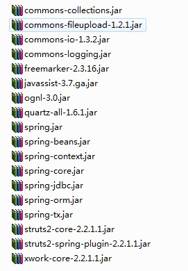

# Spring定时器的使用(Spring2.5.6)

`原创` `2011-10-09 17:08:56`

之前有写过一篇spring3.0定时器的配置：[http://blog.csdn.net/cl61917380/article/details/6265664](http://blog.csdn.net/cl61917380/article/details/6265664)

spring3.0确实是要简单好多，不过很多项目都还没有升级到spring3.0所以对于2.5的配置也需要了解。

我这里只说明spring的配置，如果不会整合的朋友可以查看我写的关于SSH或SSI整合的配置。

下面说明详细的配置：

applicationContext.xml

```
<?xml version="1.0" encoding="UTF-8"?>
<beans xmlns="http://www.springframework.org/schema/beans"
	xmlns:xsi="http://www.w3.org/2001/XMLSchema-instance" xmlns:aop="http://www.springframework.org/schema/aop"
	xmlns:context="http://www.springframework.org/schema/context" xmlns:tx="http://www.springframework.org/schema/tx"
	xsi:schemaLocation="http://www.springframework.org/schema/beans http://www.springframework.org/schema/beans/spring-beans-2.5.xsd
       http://www.springframework.org/schema/tx 
	   http://www.springframework.org/schema/tx/spring-tx-2.5.xsd
       http://www.springframework.org/schema/aop 
	   http://www.springframework.org/schema/aop/spring-aop-2.5.xsd
	   http://www.springframework.org/schema/context 
	   http://www.springframework.org/schema/context/spring-context-2.5.xsd">
	<!-- 支持元注释 -->
	<context:annotation-config />

	<!-- 扫描包目录 -->
	<context:component-scan base-package="com"></context:component-scan>
 	
 	<import resource="scheduler.xml"/>
	
</beans>
```

scheduler.xml:

```
<?xml version="1.0" encoding="GBK"?>
<!DOCTYPE beans PUBLIC "-//SPRING//DTD BEAN 2.0//EN" "http://www.springframework.org/dtd/spring-beans-2.0.dtd">
<beans>
	<!-- 定时扫描周期,如果已到期,则结束周期 -->
    <!-- 定时服务定义 -->   
    <bean class="org.springframework.scheduling.quartz.SchedulerFactoryBean">   
        <!-- 自动启动 -->   
        <property name="autoStartup">   
            <value>true</value>   
        </property>   
        <property name="triggers">   
            <list> 
                <ref local="testTrigger"/>  
            </list>   
        </property>   
    </bean> 
    <bean id="testTrigger" class="org.springframework.scheduling.quartz.CronTriggerBean">
    	<property name="jobDetail">   
            <ref bean="testJobDetail"/>   
        </property>   
        <property name="cronExpression">   
            <!-- 过一秒开始，每间隔两秒执行-->   
            <value>1/2 * * * * ?</value>   
        </property> 
    </bean> 
    <bean id="testJobDetail" class="org.springframework.scheduling.quartz.MethodInvokingJobDetailFactoryBean">
    	<property name="targetObject">
            <ref bean="testJob"/>
        </property>   
        <property name="targetMethod">
            <value>test</value>
        </property>   
        <property name="concurrent" value="false"/>  
    </bean>
    <bean id="testJob" class="com.coooliang.TestJob"></bean>
</beans>
```

TestJob类：

```java
package com.coooliang;

public class TestJob {
	public void test() {
		System.out.println("test!!!");//运行效果是每间隔两秒打印这句话一次。
	}
}
```

所需要的jar包(我这里有引入struts的，一般SSH整合后的jar包就可以了)：





